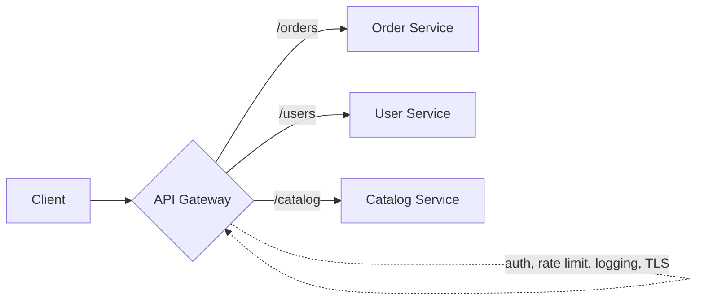

# API Gateway Pattern

## What it is
A single entry point that sits in front of your microservices. Clients talk to the gateway, which **routes** requests to the right service and handles **cross-cutting concerns** — authentication, rate limiting, TLS termination, request/response transformation, and aggregation — so individual services don't each reimplement them.

## Flow diagram


## When to use
- You have multiple services and don't want clients to know each service's location/port.
- You want **one place** for auth, throttling, CORS, and request logging.
- Clients are external/untrusted and you need a security boundary.

## When NOT to use
- A single service / monolith (a gateway adds a hop and complexity for no benefit).
- Pure internal east-west traffic where a service mesh fits better.

## How to use with Node.js

### Option A — Managed: AWS API Gateway / ALB (preferred on AWS)
Use **API Gateway** (JWT/Cognito authorizer, usage plans, throttling) or an **ALB** in front of ECS services. No gateway code to maintain — you configure routing + auth.

### Option B — Custom Node gateway (Express) when you need bespoke logic
```ts
import express from 'express';
import { createProxyMiddleware } from 'http-proxy-middleware';
import rateLimit from 'express-rate-limit';

const app = express();

// Cross-cutting: auth once, at the edge
app.use(async (req, res, next) => {
  const token = req.headers.authorization?.split(' ')[1];
  if (!token || !(await verifyJwt(token))) return res.status(401).json({ error: 'unauthorized' });
  next();
});

// Cross-cutting: rate limiting (back with Redis for a multi-instance gateway)
app.use(rateLimit({ windowMs: 60_000, max: 100 }));

// Routing: forward to downstream services (service URLs from discovery/config)
app.use('/orders', createProxyMiddleware({ target: process.env.ORDER_SVC!, changeOrigin: true }));
app.use('/users',  createProxyMiddleware({ target: process.env.USER_SVC!,  changeOrigin: true }));
app.use('/catalog',createProxyMiddleware({ target: process.env.CATALOG_SVC!, changeOrigin: true }));

app.listen(8080);
```

## Pros
- Single security/auth boundary; services stay simple.
- Hides internal topology from clients; lets you refactor services freely.
- Central place for throttling, logging, caching, TLS.
- Can aggregate/transform responses for clients.

## Cons
- A potential **single point of failure / bottleneck** (must be HA + scaled).
- Adds a network hop (latency).
- Can become a "god object" if too much business logic leaks into it — keep it thin.

## Real-time use cases
- A public e-commerce API where mobile/web clients hit one endpoint and the gateway routes to order/user/catalog services.
- A SaaS platform exposing partner APIs with per-key throttling and auth at the edge.

## Lead-level notes
- On AWS, **prefer managed** (API Gateway/ALB + WAF) over a hand-rolled gateway unless you need custom logic.
- Keep the gateway **stateless and thin** — routing + cross-cutting only, no domain logic.
- Make it **highly available** (multi-AZ, autoscaled) since everything depends on it.
- See also: **BFF** (a gateway specialized per client) and **API Composition** (aggregating responses).
