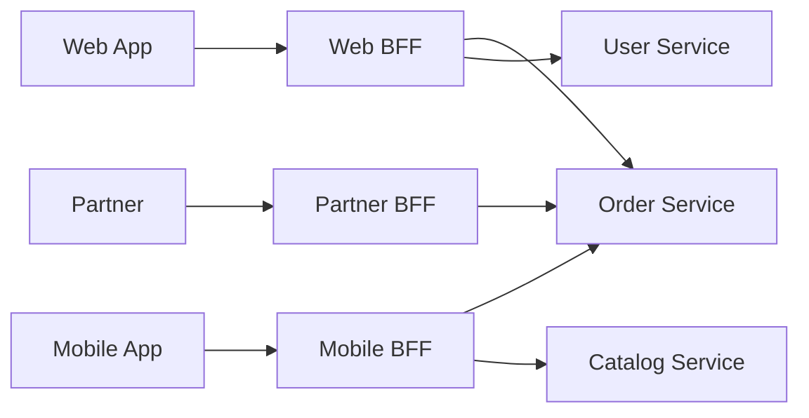

# Backend for Frontend (BFF) Pattern

## What it is
A variation of the API Gateway where you build a **separate gateway per client type** (web, mobile, partner). Each BFF is tailored to the needs of its specific frontend — shaping payloads, aggregating exactly what that client needs, and avoiding over-fetching.

## Flow diagram


## When to use
- Different clients need **different data shapes** (a mobile app wants a lean payload; a web dashboard wants rich data).
- You want frontend teams to **own their BFF** and iterate independently.
- A single generic gateway is becoming bloated with client-specific conditionals.

## When NOT to use
- You have only one client, or all clients have near-identical needs (a single gateway suffices).
- Team is small — multiple BFFs multiply maintenance.

## How to use with Node.js
A BFF is typically a small NestJS/Express service per client. Node is ideal here because of fast I/O and easy JSON shaping.

```ts
// mobile-bff: returns a lean, mobile-optimized payload aggregated from services
import express from 'express';
const app = express();

app.get('/home', async (req, res) => {
  const userId = req.user.id;
  // Fetch in parallel, then shape specifically for mobile (minimal fields).
  const [profile, orders, promos] = await Promise.all([
    fetch(`${USER_SVC}/users/${userId}`).then((r) => r.json()),
    fetch(`${ORDER_SVC}/users/${userId}/orders?limit=3`).then((r) => r.json()),
    fetch(`${PROMO_SVC}/active`).then((r) => r.json()),
  ]);

  res.json({
    name: profile.firstName,                       // mobile needs only first name
    recentOrders: orders.map((o) => ({ id: o.id, status: o.status })), // trimmed
    promoCount: promos.length,                     // just a count, not full objects
  });
});

app.listen(8081);
```
> The **web BFF** for the same screen might return full order details, addresses, and richer promo objects — same downstream services, different shaping.

## Pros
- Each client gets an **optimized payload** (less over/under-fetching, better mobile perf).
- Frontend teams **own and evolve** their BFF independently.
- Client-specific logic stays out of shared services.

## Cons
- **Code duplication** across BFFs (mitigate with shared libraries).
- More services to deploy/operate.
- Risk of business logic creeping into the BFF — keep it to aggregation/shaping.

## Real-time use cases
- A streaming app where the **TV app**, **mobile app**, and **web** each need very different home-screen payloads.
- An e-commerce platform with a lightweight mobile BFF and a feature-rich web BFF.

## Lead-level notes
- BFF is "API Gateway specialized per experience." Use it when client needs **diverge**.
- Consider **GraphQL** as an alternative — a single flexible endpoint lets each client query exactly what it needs (but adds its own complexity: N+1, query-cost limits).
- Keep BFFs **thin**: aggregation + shaping, never the source of truth for domain rules.
