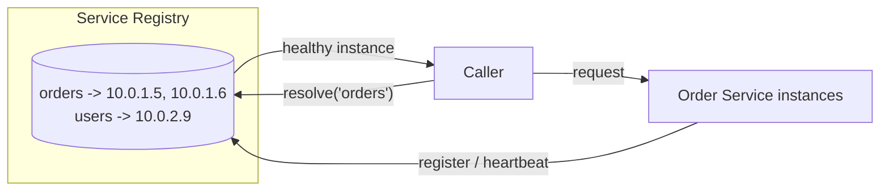

# Service Discovery Pattern

## What it is
A mechanism for services to **find each other dynamically** without hard-coded hosts/ports. As instances scale up/down or move, the discovery system keeps an up-to-date registry, and callers resolve a logical service name to a healthy instance.

## Flow diagram


## When to use
- Instances are **ephemeral** (containers/autoscaling) and IPs change constantly.
- You need **client-side or server-side load balancing** across instances.
- You want health-aware routing (don't send traffic to unhealthy instances).

## When NOT to use
- Small/static deployments with stable endpoints behind a load balancer (the LB *is* your discovery).
- Fully managed setups where the platform already handles it (see below).

## How to use with Node.js

### On AWS (preferred): let the platform do it
- **ECS Service Connect / AWS Cloud Map** + an **ALB**: services register automatically; you call a stable DNS name (`orders.internal`) and the platform routes to healthy tasks.
- **EKS:** Kubernetes Services + DNS provide discovery natively.

```ts
// With Cloud Map / ECS Service Connect you just call a stable name — discovery is transparent.
const res = await fetch('http://orders.my-namespace:3000/orders/42');
```

### Self-managed example (client-side discovery with a registry)
```ts
// Resolve a healthy instance from a registry (e.g., Consul/etcd/Redis), with caching.
class Discovery {
  private cache = new Map<string, { instances: string[]; ts: number }>();

  async resolve(service: string): Promise<string> {
    let entry = this.cache.get(service);
    if (!entry || Date.now() - entry.ts > 10_000) {            // refresh every 10s
      const instances = await registry.getHealthyInstances(service);
      entry = { instances, ts: Date.now() };
      this.cache.set(service, entry);
    }
    if (!entry.instances.length) throw new Error(`no healthy instances for ${service}`);
    // simple client-side load balancing
    return entry.instances[Math.floor(Math.random() * entry.instances.length)];
  }
}

const disco = new Discovery();
const base = await disco.resolve('orders');
const order = await fetch(`${base}/orders/42`).then((r) => r.json());
```

## Pros
- Services scale/move freely; callers always reach a healthy instance.
- Enables load balancing and graceful instance removal.
- Decouples callers from physical topology.

## Cons
- The registry is **critical infrastructure** (must be HA; stale data causes failed calls).
- Added complexity vs a simple load balancer.
- Client-side discovery pushes LB logic into every service.

## Real-time use cases
- A container platform where order-service tasks autoscale from 2 → 50 during peak and callers must always hit live instances.
- A multi-service backend using ECS Service Connect so services call each other by name.

## Lead-level notes
- **Server-side discovery** (LB/ALB, Cloud Map) is simpler and usually the right answer on AWS — prefer it over client-side.
- **Client-side discovery** (Consul/Eureka-style) gives finer control but more complexity.
- Always pair with **health checks** so only healthy instances are returned, and add **retries** for the race where an instance dies between resolve and call.
