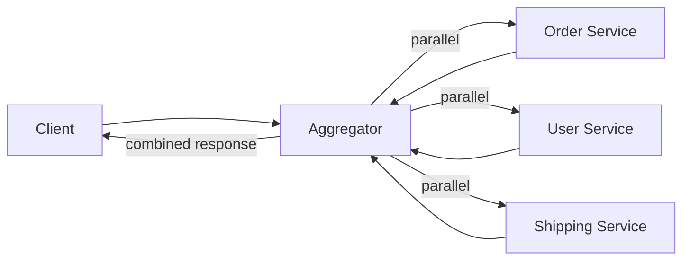

# API Composition / Aggregator Pattern

## What it is
A composer (often in the gateway/BFF) that **invokes multiple services, combines their responses, and returns a single unified result** to the client. It's the query-side answer to "the data I need lives in several services."

## Flow diagram


## When to use
- A client view needs data **owned by multiple services** (e.g., an "order details" page: order + customer + shipping).
- With `Database per Service`, you **can't JOIN across services** — composition replaces the JOIN at the API layer.

## When NOT to use
- The composition fans out to too many services with large data (latency/coupling) — consider **CQRS** with a pre-built read model instead.
- The data is owned by a single service (just call it).

## How to use with Node.js
Node excels here: concurrent I/O with `Promise.all`, plus partial-failure handling with `Promise.allSettled`.

```ts
import express from 'express';
const app = express();

app.get('/orders/:id/details', async (req, res) => {
  const { id } = req.params;

  // 1) Fetch the order first (we need its userId / shipmentId).
  const order = await fetch(`${ORDER_SVC}/orders/${id}`).then((r) => r.json());

  // 2) Fetch dependent data in parallel; tolerate partial failures.
  const [userR, shipR] = await Promise.allSettled([
    fetch(`${USER_SVC}/users/${order.userId}`).then((r) => r.json()),
    fetch(`${SHIP_SVC}/shipments/${order.shipmentId}`).then((r) => r.json()),
  ]);

  // 3) Compose — degrade gracefully if a non-critical service failed.
  res.json({
    order,
    customer: userR.status === 'fulfilled' ? userR.value : null,
    shipping: shipR.status === 'fulfilled' ? shipR.value : { status: 'unavailable' },
  });
});

app.listen(8080);
```

## Pros
- Clients make **one call** instead of many (fewer round trips, simpler frontend).
- Works naturally with `Database per Service` (no cross-service JOINs needed).
- Can **degrade gracefully** (return partial data if a non-critical service is down).

## Cons
- Latency = the **slowest** dependency (mitigate with parallelism + timeouts).
- The aggregator is coupled to several services' contracts.
- Risk of overloading downstream services (add caching, bulkheads, circuit breakers).

## Real-time use cases
- An "order details" or "user dashboard" screen assembling data from order, user, payment, and shipping services.
- A product page combining catalog, pricing, inventory, and reviews services.

## Lead-level notes
- Always use **`Promise.all`/`allSettled`** for parallel fan-out, with **per-call timeouts** and **circuit breakers** so one slow service doesn't hang the whole response.
- For high-traffic reads where composition is too slow/expensive, switch to **CQRS**: maintain a denormalized read model updated via events, so the read is a single fast lookup.
- Decide which dependencies are **critical** vs **optional** and degrade gracefully on the optional ones.
