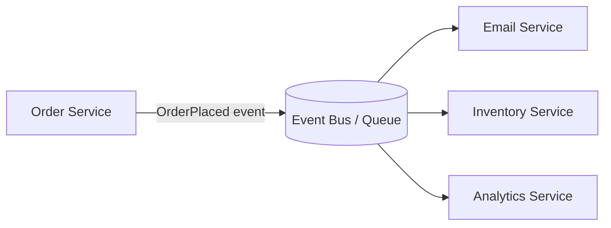

# Asynchronous Messaging / Event-Driven Pattern

## What it is
Services communicate by **producing and consuming messages/events** through a broker (SNS/SQS, EventBridge, Kafka/MSK, RabbitMQ) instead of calling each other synchronously. Producers don't know or wait for consumers — they emit an event and move on.

## Flow diagram


## When to use
- Services should be **loosely coupled** and independently scalable/deployable.
- Work can be done **asynchronously** (notifications, downstream updates, analytics).
- You need **load leveling** (absorb spikes) or **fan-out** (one event → many consumers).
- Resilience: a consumer being down shouldn't fail the producer.

## When NOT to use
- The caller **needs an immediate response/result** (use sync REST/gRPC).
- Strong, immediate consistency is required.

## How to use with Node.js

### Publish (producer) — SNS fan-out
```ts
import { SNSClient, PublishCommand } from '@aws-sdk/client-sns';
const sns = new SNSClient({});

export async function emitOrderPlaced(order: { id: string; userId: string; total: number }) {
  await sns.send(new PublishCommand({
    TopicArn: process.env.ORDER_TOPIC_ARN!,
    Message: JSON.stringify(order),
    MessageAttributes: { eventType: { DataType: 'String', StringValue: 'OrderPlaced' } },
  }));
  // Producer returns immediately; consumers process independently.
}
```

### Consume — SQS subscriber (Lambda, partial batch failure)
```ts
import type { SQSEvent, SQSBatchResponse } from 'aws-lambda';

export const handler = async (e: SQSEvent): Promise<SQSBatchResponse> => {
  const batchItemFailures: { itemIdentifier: string }[] = [];
  for (const r of e.Records) {
    try {
      const order = JSON.parse(r.body);
      await reserveInventory(order);   // MUST be idempotent (at-least-once delivery)
    } catch {
      batchItemFailures.push({ itemIdentifier: r.messageId }); // retry just this one -> DLQ
    }
  }
  return { batchItemFailures };
};
```

### NestJS microservice transport (built-in abstraction)
```ts
// A NestJS service can be a message consumer via @EventPattern
import { Controller } from '@nestjs/common';
import { EventPattern, Payload } from '@nestjs/microservices';

@Controller()
export class InventoryConsumer {
  @EventPattern('OrderPlaced')
  async handle(@Payload() order: any) {
    await this.inventory.reserve(order); // idempotent
  }
}
```

## Pros
- **Loose coupling** — add/remove consumers without touching producers.
- **Resilience** — broker buffers messages; a down consumer catches up later.
- **Scalability / load leveling** — spikes grow the queue, not crash the consumer.
- **Fan-out** — one event drives many independent reactions.

## Cons
- **Eventual consistency** — consumers lag the producer.
- **Harder to debug/trace** — flows are implicit (need distributed tracing + correlation IDs).
- **Duplicates** — at-least-once delivery demands **idempotent** consumers.
- **No immediate result** — not for request/response needs.

## Real-time use cases
- `OrderPlaced` → fan out to email confirmation, inventory reservation, and analytics.
- Spiky workloads buffered through SQS so the database isn't overwhelmed.
- Cross-service notifications (user signed up → welcome email + CRM sync).

## Lead-level notes
- **Choose the right broker:** SQS (durable work buffering), SNS (fan-out/A2P), EventBridge (content routing/filtering/replay), Kafka/MSK (high-throughput ordered streams). See `../aws/aws-services-comparison.md`.
- **Always** pair with **idempotency**, **DLQs**, and **retries** — duplicates and failures are guaranteed.
- Use the **Transactional Outbox** (file 10) to avoid the dual-write problem between your DB and the broker.
- Add **correlation IDs** in message attributes so you can trace an event across consumers.
- Orchestration (Step Functions/Saga) vs choreography (pure events): events maximize decoupling but make end-to-end flows harder to follow.
