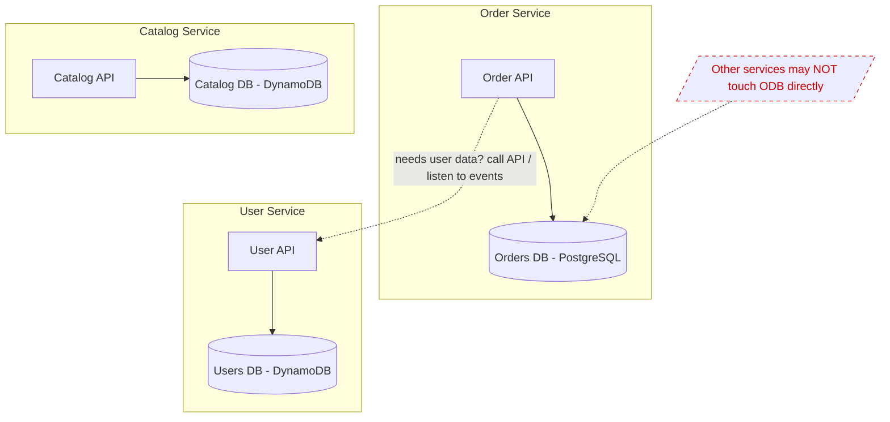

# Database per Service Pattern

## What it is
Each microservice **owns its own private database** and is the only one allowed to access it directly. Other services must go through the owning service's API/events — never reach into its tables. This enforces loose coupling and lets each service pick the best data store for its job (polyglot persistence).

## Flow diagram


## When to use
- You want services to be **independently deployable and scalable** (a shared DB couples them tightly).
- Different services have **different data needs** (relational vs key-value vs search).
- You need clear **ownership boundaries** and the freedom to change one service's schema without breaking others.

## When NOT to use
- Early-stage / modular monolith where a single DB is simpler and consistency is easy.
- Heavy cross-entity transactional/reporting needs that a shared relational DB serves far more simply.

## How to use with Node.js
The pattern is mostly **discipline + architecture**, not a library. In NestJS, each service is its own deployable with its own connection/config.

```ts
// order-service: owns ONLY the orders DB; never connects to users DB.
@Module({
  imports: [
    TypeOrmModule.forRoot({
      type: 'postgres',
      url: process.env.ORDERS_DB_URL,   // private to this service
      entities: [Order, OrderItem],
    }),
  ],
})
export class OrderModule {}

// To get user data, the order service calls the user service's API or
// consumes user events — it does NOT query the users database.
async function enrichWithUser(order: Order) {
  const user = await fetch(`${USER_SVC}/users/${order.userId}`).then((r) => r.json());
  return { ...order, customerName: user.name };
}
```

## Pros
- **Loose coupling** — schema changes in one service don't break others.
- **Independent scaling & deployment** per service.
- **Polyglot persistence** — right database for each job.
- Clear **ownership** and smaller blast radius.

## Cons
- **No cross-service JOINs / ACID transactions** — need `API Composition`, `Saga`, and eventual consistency.
- **Data duplication** — services keep local copies/projections of others' data.
- **Operational overhead** — many databases to run, back up, and monitor.
- **Reporting/analytics** is harder (use CDC → a data lake/warehouse).

## Real-time use cases
- An e-commerce platform: orders in PostgreSQL, sessions/carts in DynamoDB, search in OpenSearch — each owned by its service.
- A platform where the payments service must isolate its (PCI-scoped) database from everything else.

## Lead-level notes
- This is the **foundational** microservices data pattern — it's what *forces* Saga, Outbox, API Composition, and CQRS.
- The **#1 anti-pattern** is a shared database across services ("distributed monolith") — it silently recouples everything.
- For analytics that needs all data together, **don't** query services' DBs — stream changes (CDC/DynamoDB Streams/Kafka) into S3/Redshift (separate OLAP).
- Accept **eventual consistency** as the trade-off for independence; design with idempotency.
