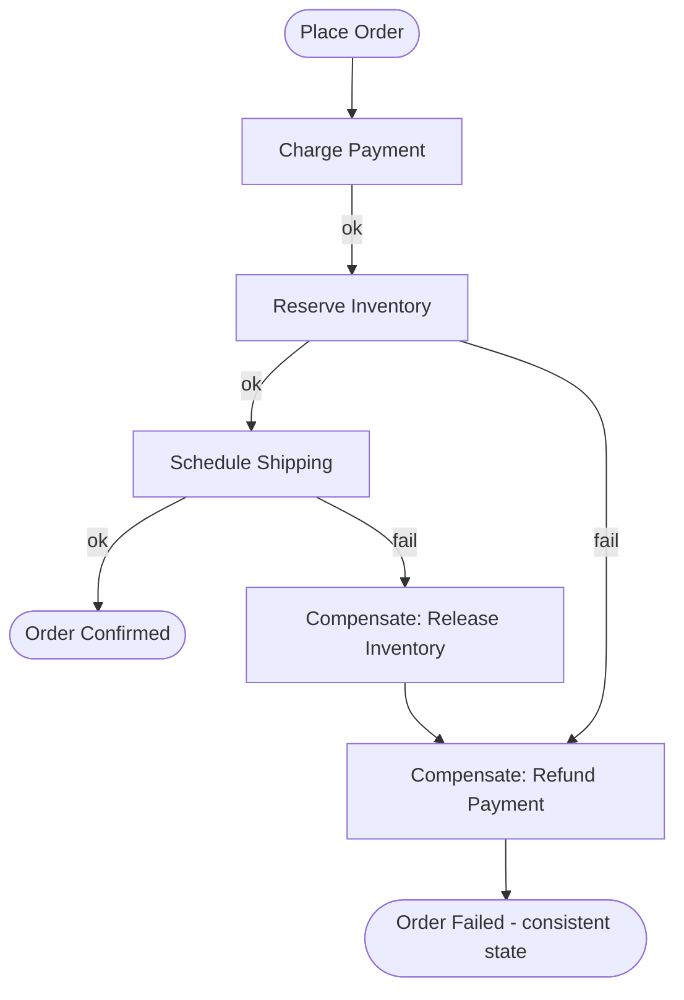

# Saga Pattern

## What it is
A way to manage a **transaction that spans multiple services** when there's no distributed ACID transaction. A saga is a sequence of **local transactions**; if a step fails, previously completed steps are undone by **compensating transactions**. Two flavors: **orchestration** (a central coordinator drives the steps) and **choreography** (services react to each other's events).

## Flow diagram (orchestration)


## When to use
- A business operation updates data in **several services**, each with its own DB (`Database per Service`).
- You can tolerate **eventual consistency** and need a way to keep the system consistent on partial failure.

## When NOT to use
- The whole operation fits in **one service / one database** (use a local ACID transaction).
- Steps can't be meaningfully compensated (rare, but think it through).

## How to use with Node.js

### Orchestration with AWS Step Functions (recommended for complex sagas)
Step Functions gives durable state, per-step retries, and visual history. Each step is a Lambda/service call; failures route to compensation states.

```ts
// Each saga step is an idempotent Lambda. The state machine (defined in CDK/ASL)
// wires success -> next step, failure -> compensation.
export const chargePayment = async (input: { orderId: string; amount: number }) => {
  // idempotent: keyed by orderId so a retry doesn't double-charge
  return paymentProvider.charge(input.orderId, input.amount);
};

export const refundPayment = async (input: { orderId: string }) => {
  return paymentProvider.refund(input.orderId); // compensation
};
```

### Choreography with events (simpler, fewer steps)
```ts
// payment-service reacts to OrderPlaced, then emits its own event
@EventPattern('OrderPlaced')
async onOrderPlaced(@Payload() order) {
  try {
    await this.payment.charge(order.id, order.total);   // idempotent
    await this.bus.emit('PaymentCharged', { orderId: order.id });
  } catch {
    await this.bus.emit('PaymentFailed', { orderId: order.id });
  }
}

// inventory-service reacts to PaymentCharged; on failure emits compensation trigger
@EventPattern('PaymentCharged')
async onPaymentCharged(@Payload() e) {
  try { await this.inventory.reserve(e.orderId); await this.bus.emit('InventoryReserved', e); }
  catch { await this.bus.emit('ReserveFailed', e); } // -> payment-service refunds
}
```

## Pros
- Maintains consistency across services **without distributed locks / 2PC**.
- Resilient to partial failure (compensations restore a consistent state).
- Orchestration gives great visibility; choreography gives maximum decoupling.

## Cons
- **Complex** — you must design and test every compensation path.
- **Eventual consistency** — a brief window where the operation is partially applied.
- **No automatic rollback** — compensations are manual business logic (and can themselves fail).
- Choreography can become hard to follow ("event spaghetti") as it grows.

## Real-time use cases
- **Order fulfillment:** payment → inventory → shipping, with refund/release compensations.
- **Travel booking:** reserve flight + hotel + car; cancel the others if one fails.
- **Money transfer** across accounts owned by different services.

## Lead-level notes
- **Orchestration (Step Functions)** for complex flows needing visibility + compensation; **choreography (events)** for simpler, loosely-coupled flows.
- Every step **must be idempotent** (retries + at-least-once delivery cause re-execution).
- Pair with the **Transactional Outbox** (file 10) so emitting an event and committing local state are atomic.
- Design compensations carefully — some actions (e.g., "email sent") can't be undone, so order steps to do irreversible things last.
