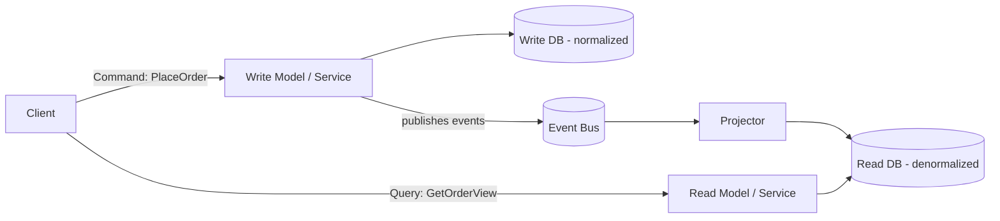

# CQRS (Command Query Responsibility Segregation) Pattern

## What it is
Separate the **write model** (commands that change state) from the **read model** (queries that return data). Instead of one model serving both, you maintain an optimized read model — often denormalized and in a different store — kept in sync with writes, usually via events.

## Flow diagram


## When to use
- Read and write workloads have **very different shapes/scale** (e.g., 100x more reads than writes).
- Reads need **denormalized/aggregated** views that are expensive to compute on the fly (replacing slow `API Composition`).
- You're already event-driven / event-sourced and want fast, purpose-built read models.

## When NOT to use
- Simple CRUD where one model is fine — CQRS adds real complexity.
- Strong read-after-write consistency is mandatory (read model lags writes).

## How to use with Node.js

### Write side — handle a command, persist, emit an event
```ts
// command handler
async function placeOrder(cmd: PlaceOrderCommand) {
  const order = await ordersRepo.insert({ ...cmd, status: 'PLACED' }); // normalized write DB
  await bus.emit('OrderPlaced', {
    orderId: order.id, userId: cmd.userId, items: cmd.items, total: cmd.total,
  });
  return order.id;
}
```

### Read side — a projector builds a denormalized view from events
```ts
// projector subscribes to events and maintains a read-optimized record
@EventPattern('OrderPlaced')
async project(@Payload() e) {
  // Denormalize: store everything the read screen needs in ONE record (e.g., DynamoDB)
  await readDb.put({
    pk: `ORDER#${e.orderId}`,
    userId: e.userId,
    userName: await users.nameOf(e.userId),  // pre-join user data at write time
    itemCount: e.items.length,
    total: e.total,
    status: 'PLACED',
  });
}

// query handler — single fast lookup, no joins, no fan-out
async function getOrderView(orderId: string) {
  return readDb.get({ pk: `ORDER#${orderId}` });
}
```

## Pros
- **Reads are fast & cheap** (denormalized, purpose-built, independently scalable).
- Read and write sides **scale independently**.
- Great fit with **event-driven** systems and **Event Sourcing**.
- Avoids expensive runtime `API Composition` for hot read paths.

## Cons
- **Significant complexity** — two models, a projector, and sync logic.
- **Eventual consistency** between write and read models (read can be briefly stale).
- More moving parts to operate and reason about.
- Easy to over-apply — only worth it for the right hotspots.

## Real-time use cases
- An e-commerce **order history / dashboard** read model built from order events (fast, denormalized) while writes stay normalized.
- A social feed: writes are simple, but the **timeline read model** is precomputed per user.
- Analytics-style screens that would otherwise require heavy multi-service joins.

## Lead-level notes
- CQRS is a **targeted** tool — apply it to specific high-read or composition-heavy areas, not the whole system.
- The read model is **eventually consistent**; if a screen needs immediate read-after-write, handle it (e.g., read from write model for that case, or optimistic UI).
- Frequently paired with **Event Sourcing** (file 9) — events are the natural source for building projections.
- The projector must be **idempotent** and able to **rebuild** the read model by replaying events.
