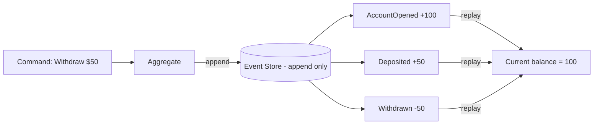

# Event Sourcing Pattern

## What it is
Instead of storing only the **current state** of an entity, you store the full **sequence of state-changing events**. Current state is derived by replaying those events. The event log is the source of truth and is **append-only**.

## Flow diagram


## When to use
- You need a **complete audit trail** / history of every change (finance, healthcare, compliance).
- You need to **reconstruct past state** ("what did this look like last Tuesday?") or do temporal queries.
- You're building **CQRS** read models and want events as the source.
- Debugging by replaying exactly what happened is valuable.

## When NOT to use
- Simple CRUD with no audit/history need — the overhead isn't worth it.
- Teams unfamiliar with the model (steep learning curve, easy to misuse).

## How to use with Node.js

### Append events; rebuild state by folding over them
```ts
type AccountEvent =
  | { type: 'AccountOpened'; balance: number }
  | { type: 'Deposited'; amount: number }
  | { type: 'Withdrawn'; amount: number };

// 1) Append-only write (e.g., DynamoDB with pk=accountId, sk=version)
async function append(accountId: string, version: number, event: AccountEvent) {
  await ddb.send(new PutCommand({
    TableName: 'events',
    Item: { pk: `ACC#${accountId}`, sk: version, ...event, ts: Date.now() },
    ConditionExpression: 'attribute_not_exists(sk)', // optimistic concurrency on version
  }));
}

// 2) Rebuild current state by replaying events (a left fold / reducer)
function reducer(state: { balance: number }, e: AccountEvent) {
  switch (e.type) {
    case 'AccountOpened': return { balance: e.balance };
    case 'Deposited':     return { balance: state.balance + e.amount };
    case 'Withdrawn':     return { balance: state.balance - e.amount };
  }
}

async function loadState(accountId: string) {
  const { Items } = await ddb.send(new QueryCommand({
    TableName: 'events',
    KeyConditionExpression: 'pk = :pk',
    ExpressionAttributeValues: { ':pk': `ACC#${accountId}` },
  }));
  return (Items as AccountEvent[]).reduce(reducer, { balance: 0 });
}
```

### Snapshots (optimization)
```ts
// Replaying thousands of events is slow -> periodically store a snapshot,
// then replay only events AFTER the snapshot version.
async function loadWithSnapshot(accountId: string) {
  const snap = await getLatestSnapshot(accountId);          // { version, state }
  const events = await getEventsAfter(accountId, snap.version);
  return events.reduce(reducer, snap.state);
}
```

## Pros
- **Complete audit log** — every change is recorded, immutable.
- **Time travel** — reconstruct any historical state; great for debugging.
- Natural fit for **CQRS** and event-driven integration (events already exist).
- No lossy updates — you never overwrite history.

## Cons
- **High complexity** and a real learning curve.
- **Querying current state requires replay** (mitigate with snapshots + read models).
- **Event schema evolution** is hard (you must handle/upcast old event versions forever).
- Storage grows indefinitely (append-only).

## Real-time use cases
- **Banking/ledger:** every transaction is an event; balance is derived; full auditability.
- **Order lifecycle:** `Placed → Paid → Shipped → Delivered` as events.
- **Collaborative editing / version history.**

## Lead-level notes
- Almost always paired with **CQRS** — build read models (projections) from the event stream so queries don't replay.
- Use **snapshots** to bound replay cost; use **optimistic concurrency** (version) to prevent conflicting appends.
- Plan for **event versioning/upcasting** from day one — old events live forever.
- On AWS: DynamoDB (with Streams) or Kinesis/Kafka are common event stores; EventStoreDB is a purpose-built option.
- It's powerful but **over-engineered for simple CRUD** — reserve it for domains that genuinely need history/audit.
