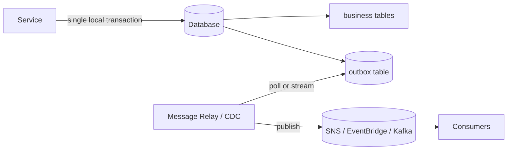

# Transactional Outbox Pattern

## What it is
A reliable way to **update your database AND publish an event atomically**. Instead of writing to the DB and then publishing to a broker (two separate operations that can fail independently — the "dual-write problem"), you write the business change **and** an event row to an **outbox table in the same local transaction**. A separate relay then reads the outbox and publishes to the broker.

## Flow diagram


## The problem it solves
```
Without outbox (BROKEN):
  await db.save(order)        // ✅ committed
  await bus.publish(event)    // ❌ crashes here -> DB has order, NO event emitted -> inconsistent
```
You can't wrap a DB write and a broker publish in one transaction — they're different systems. The outbox makes the write + the "intent to publish" atomic.

## When to use
- Any time a service must **change state and emit an event reliably** (event-driven systems, Saga, CQRS).
- You need a **guarantee** that an event is published if and only if the data change committed.

## When NOT to use
- No events are published (no dual write, no problem).
- A managed alternative already gives you atomic CDC (e.g., **DynamoDB Streams** — the change *is* the event source).

## How to use with Node.js

### Write business data + outbox row in ONE transaction
```ts
// Using a relational DB transaction (TypeORM example)
await dataSource.transaction(async (tx) => {
  const order = await tx.getRepository(Order).save({ ...input, status: 'PLACED' });

  // Same transaction: insert the event into the outbox.
  await tx.getRepository(OutboxEvent).save({
    id: randomUUID(),
    aggregate: 'Order',
    type: 'OrderPlaced',
    payload: JSON.stringify({ orderId: order.id, total: order.total }),
    published: false,
    createdAt: new Date(),
  });
}); // both commit together, or neither does
```

### Relay: publish unpublished outbox rows, then mark them sent
```ts
// Runs periodically (or driven by CDC). Must be idempotent on the consumer side.
async function relay() {
  const pending = await outboxRepo.find({ where: { published: false }, take: 100, order: { createdAt: 'ASC' } });
  for (const row of pending) {
    await sns.send(new PublishCommand({
      TopicArn: process.env.TOPIC_ARN!,
      Message: row.payload,
      MessageAttributes: { eventType: { DataType: 'String', StringValue: row.type } },
    }));
    row.published = true;
    await outboxRepo.save(row);   // at-least-once: a crash here re-publishes -> consumers must dedupe
  }
}
```

### Better relay: Change Data Capture (no polling)
- Stream the outbox table via **Debezium/Kafka Connect**, or
- On DynamoDB, use **DynamoDB Streams** directly (the item change drives a Lambda that publishes) — often removing the need for a separate outbox table entirely.

## Pros
- **Guaranteed consistency** between state change and event publication (no lost events).
- Works with any broker; decouples the service from broker availability (relay retries).
- Simple to reason about — one local transaction.

## Cons
- **At-least-once** publishing → consumers must be **idempotent** (a crash after publish, before marking, re-publishes).
- Adds an outbox table + a relay process to operate.
- Polling relays add slight latency (CDC avoids this).

## Real-time use cases
- **Order service** commits the order and reliably emits `OrderPlaced` to trigger a Saga — no risk of "order saved but event lost."
- Any service feeding a **CQRS** read model or downstream consumers where missing events would corrupt state.

## Lead-level notes
- This is the **canonical fix for the dual-write problem** — name it whenever someone "saves then publishes."
- Pair with **idempotent consumers** (dedupe by event ID) because publishing is at-least-once.
- On AWS, **DynamoDB Streams** is effectively a built-in outbox/CDC mechanism — call that out as the simpler managed alternative.
- The inverse problem (consume + update) is handled by idempotency + the **inbox** pattern.
