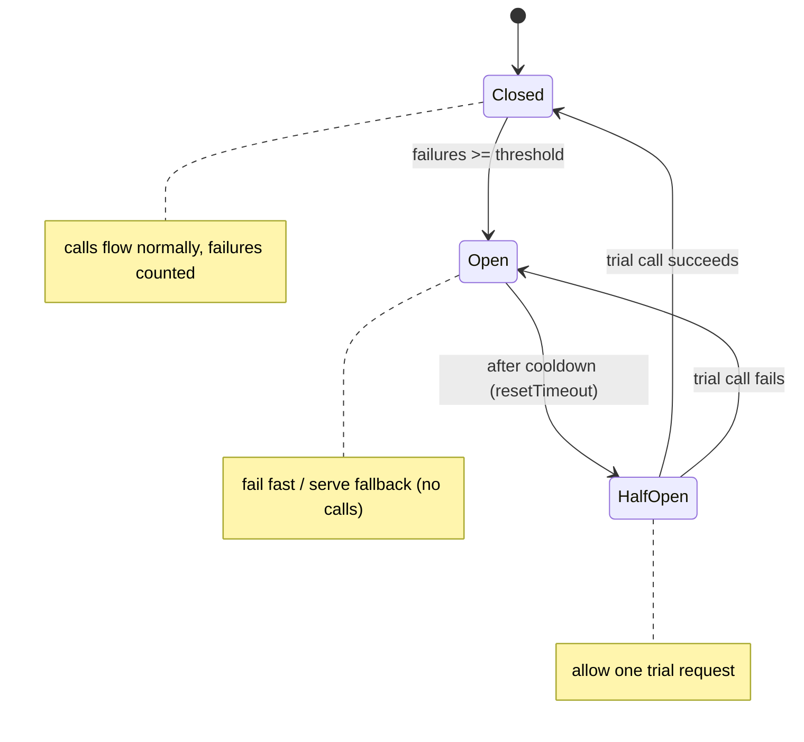

# Circuit Breaker Pattern

## What it is
A resilience pattern that **stops calling a failing dependency** once failures cross a threshold, so a struggling downstream doesn't drag down the caller. Like an electrical breaker, it "trips" (opens) to fail fast, periodically tests recovery, and closes again when healthy.

## Flow diagram (states)


## When to use
- Any **synchronous call to a remote dependency** (another service, a third-party API, a DB) that can become slow or unavailable.
- To prevent **cascading failures** — a slow dependency causing request pile-up and resource exhaustion in the caller.

## When NOT to use
- Purely local, in-process calls with no failure/latency risk.
- Fire-and-forget async messaging (the broker + retries handle reliability instead).

## How to use with Node.js (opossum)
```ts
import CircuitBreaker from 'opossum';

// The protected call — ALWAYS set a client-side timeout too.
async function getRecommendations(userId: string): Promise<string[]> {
  const res = await fetch(`${RECO_SVC}/users/${userId}`, { signal: AbortSignal.timeout(2000) });
  if (!res.ok) throw new Error(`downstream ${res.status}`);
  return res.json();
}

const breaker = new CircuitBreaker(getRecommendations, {
  timeout: 3000,                   // call considered failed beyond this
  errorThresholdPercentage: 50,    // open at >=50% failures
  resetTimeout: 10_000,            // wait 10s before half-open trial
  volumeThreshold: 10,             // need a min sample before tripping
});

// Fallback: serve degraded data while OPEN instead of erroring/hanging.
breaker.fallback(() => ['popular-1', 'popular-2']); // e.g., cached defaults

// Emit these to metrics (CloudWatch/Prometheus) for visibility.
breaker.on('open',    () => metrics.inc('reco.breaker.open'));
breaker.on('halfOpen',() => metrics.inc('reco.breaker.halfopen'));
breaker.on('close',   () => metrics.inc('reco.breaker.close'));

export const recommendations = (userId: string) => breaker.fire(userId) as Promise<string[]>;
```

## Pros
- Prevents **cascading failures** and resource exhaustion in the caller.
- **Fails fast** (no waiting on a dead dependency) → better latency under failure.
- Enables **graceful degradation** via fallbacks.
- Gives the downstream time to **recover** (no relentless hammering).

## Cons
- Adds complexity and **tuning** (thresholds, timeouts, cooldown) — bad config causes false trips or slow tripping.
- A fallback may serve **stale/partial** data.
- Per-instance breakers don't share state across a fleet (each instance learns independently).

## Real-time use cases
- A product page calling a flaky **recommendations** service → open the circuit and show a cached/default list.
- A checkout calling a **payment provider** that starts timing out → fail fast and queue for retry rather than hanging every request.

## Lead-level notes
- Always combine **timeout + retry (backoff/jitter) + circuit breaker** — they solve different parts of the problem.
- Retries amplify load during an incident; the breaker is what stops the amplification.
- Pair with the **Bulkhead** pattern (file 13) to isolate the resource pool per dependency.
- Export breaker state as **metrics** so you can alarm on "circuit open" (a leading indicator of a downstream outage).
- On a service mesh (Istio/App Mesh), circuit breaking can be configured at the **proxy** level instead of in code.
