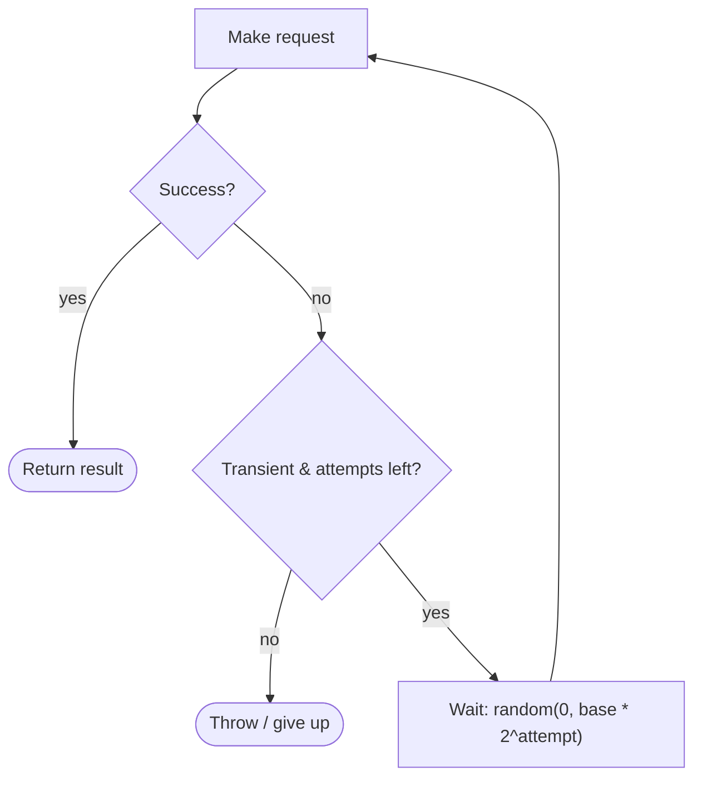

# Retry with Exponential Backoff & Jitter Pattern

## What it is
Automatically **retry transient failures** (timeouts, 429s, 5xx, dropped connections) with **increasing delays** between attempts (exponential backoff) plus **randomness** (jitter) to avoid synchronized retry storms. Only retry idempotent/transient errors, and always cap the number of attempts.

## Flow diagram


## Why jitter matters
```
No jitter: 1000 clients fail at t=0 -> all retry at t=1s, t=2s, t=4s...
           -> synchronized waves re-overwhelm the recovering service (thundering herd).
Full jitter: each client waits random(0, backoff) -> retries spread out smoothly.
```

## When to use
- Calls to dependencies that can fail **transiently** (network blips, throttling, brief unavailability).
- The operation is **idempotent** (or made idempotent) so a retry is safe.

## When NOT to use
- **Non-idempotent** operations without an idempotency key (risk of duplicate side effects).
- **Permanent** errors (400/validation, 401/403) — retrying is pointless and wasteful.

## How to use with Node.js
```ts
const sleep = (ms: number) => new Promise((r) => setTimeout(r, ms));

const isRetryable = (err: any) =>
  err?.name === 'AbortError' ||                 // timeout
  err?.status === 429 || err?.status >= 500 ||  // throttle / server error
  ['ETIMEDOUT', 'ECONNRESET'].includes(err?.code);

async function retry<T>(fn: () => Promise<T>, opts = { maxAttempts: 5, baseMs: 100, maxMs: 10_000 }): Promise<T> {
  let attempt = 0;
  while (true) {
    attempt++;
    try {
      return await fn();
    } catch (err) {
      if (attempt >= opts.maxAttempts || !isRetryable(err)) throw err;
      const expBackoff = Math.min(opts.maxMs, opts.baseMs * 2 ** (attempt - 1));
      const delay = Math.random() * expBackoff;   // FULL JITTER
      await sleep(delay);
    }
  }
}

// Usage (the call is idempotent — a GET, or a write guarded by an idempotency key)
const data = await retry(() =>
  fetch(`${SVC}/resource`, { signal: AbortSignal.timeout(2000) })
    .then((r) => { if (!r.ok) throw Object.assign(new Error('http'), { status: r.status }); return r.json(); }),
);
```
> The **AWS SDK v3** has built-in retries with backoff (including an adaptive mode) — configure `maxAttempts`/`retryMode` rather than hand-rolling for AWS calls.

## Pros
- Smooths over **transient** failures transparently → higher effective availability.
- **Jitter** prevents thundering-herd retry storms against a recovering service.
- Simple, broadly applicable, built into many SDKs/clients.

## Cons
- Retries **amplify load** — dangerous during a real outage if uncapped (always cap + add a circuit breaker).
- Can **mask** a persistent problem if you retry too aggressively.
- Adds latency to the failing path (each retry waits).
- Unsafe for non-idempotent operations without dedup.

## Real-time use cases
- Retrying a **DynamoDB** call that throttled (`ProvisionedThroughputExceededException`).
- Retrying a transient **third-party API** 503/timeout in a checkout flow.
- Retrying inter-service calls during a brief deploy/rolling restart of the callee.

## Lead-level notes
- Retry is one leg of the resilience triad: **timeout + retry (backoff/jitter) + circuit breaker**.
- Establish a **retry budget** / cap so retries can't turn a partial outage into a full one.
- Make the operation **idempotent** (idempotency key) before enabling retries on writes.
- Respect `Retry-After` headers on 429/503.
- For AWS calls, lean on the **SDK's** retry config; for inter-service HTTP, wrap with this + a breaker.
