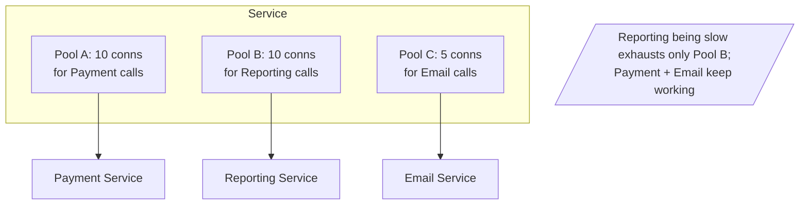

# Bulkhead Pattern

## What it is
Named after the watertight compartments in a ship's hull: you **isolate resources into separate pools** so that a failure or overload in one part can't sink the whole service. If one dependency or workload exhausts its pool, others keep running on their own pools.

## Flow diagram


## When to use
- One service calls **multiple dependencies** and you don't want a slow one to starve resources needed by the others.
- You have **mixed workloads** (critical vs non-critical) sharing the same process and want to protect the critical path.
- Multi-tenant systems where one tenant shouldn't exhaust shared capacity.

## When NOT to use
- A trivial service with a single dependency and no contention.
- When the added pool management isn't justified by the risk.

## How to use with Node.js

### Separate concurrency pools per dependency
```ts
import pLimit from 'p-limit';

// Each dependency gets its OWN concurrency limit (its own "compartment").
const paymentPool   = pLimit(10);  // critical: protected capacity
const reportingPool = pLimit(5);   // non-critical: capped so it can't hog resources
const emailPool     = pLimit(5);

export const charge   = (o: Order)  => paymentPool(() => fetch(`${PAY_SVC}/charge`, { /* ... */ }));
export const report   = (q: Query)  => reportingPool(() => fetch(`${RPT_SVC}/run`, { /* ... */ }));
export const sendMail = (m: Mail)   => emailPool(() => fetch(`${MAIL_SVC}/send`, { /* ... */ }));

// If reporting gets slow, only reportingPool fills up; charge() still has its 10 slots.
```

### Separate DB connection pools per workload
```ts
// Isolate a heavy/long-running query workload from the latency-sensitive API workload.
const apiPool     = new Pool({ max: 20, connectionString: DB_URL }); // user-facing
const batchPool   = new Pool({ max: 5,  connectionString: DB_URL }); // background/reporting
// A runaway batch job exhausts only batchPool's 5 connections, not the API's 20.
```

### Isolation at the platform level
- Run **critical vs non-critical workloads as separate services/task groups** (the strongest bulkhead).
- Lambda **reserved concurrency** per function isolates one function's blast radius from others.

## Pros
- **Fault isolation** — one overloaded dependency/workload can't take down the whole service.
- Protects the **critical path** from non-critical noise.
- Improves overall stability and predictability under partial failure.

## Cons
- **Resource fragmentation** — partitioning pools can underutilize capacity (idle slots in one pool while another is full).
- More configuration/tuning (pool sizes per dependency).
- Doesn't by itself recover from failure — combine with circuit breaker/retry.

## Real-time use cases
- An API that calls payment (critical) and analytics (non-critical) — analytics slowness must never block payments.
- A service with both fast user queries and heavy reporting queries against the same DB — separate connection pools.
- Lambda functions sharing an account concurrency limit — reserved concurrency isolates the important ones.

## Lead-level notes
- Bulkhead is about **isolation**; circuit breaker is about **failing fast**; retry is about **transient recovery** — use them together.
- The strongest bulkhead is **separate deployables** (different services/pools/instances) — in-process pools are a lighter-weight version.
- On AWS, **Lambda reserved concurrency** and **separate ECS services** are practical bulkheads; **RDS Proxy** pools also help isolate connection usage.
- Size pools from real load tests; revisit when traffic patterns change.
