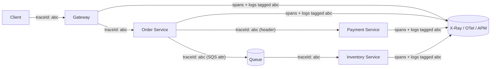

# Distributed Tracing & Correlation ID Pattern

## What it is
A way to **follow a single request as it travels across multiple services**. A **correlation/trace ID** is generated at the edge and propagated through every hop (HTTP headers, message attributes), and each service emits **spans** that together form an end-to-end **trace**. This is what lets you answer "which service made this request slow?" and "show me all logs for this one user action."

## Flow diagram


## When to use
- **Always**, in any multi-service system. Without it, debugging distributed flows is guesswork.
- Especially critical with **async/event-driven** flows where the path is implicit.

## How to use with Node.js

### Correlation ID via AsyncLocalStorage (no threading through every function)
```ts
import { AsyncLocalStorage } from 'async_hooks';
import { randomUUID } from 'crypto';

export const ctx = new AsyncLocalStorage<{ correlationId: string }>();
export const getCorrelationId = () => ctx.getStore()?.correlationId;

// Express/NestJS middleware: read inbound id or generate one, store for the request lifetime.
export function correlationMiddleware(req, res, next) {
  const correlationId = req.headers['x-request-id'] ?? randomUUID();
  res.setHeader('x-request-id', correlationId);
  ctx.run({ correlationId }, () => next());
}

// Logger automatically includes it (structured logs become correlatable).
logger.info({ correlationId: getCorrelationId(), msg: 'charging payment' });
```

### Propagate across hops
```ts
// HTTP: forward the header downstream
await fetch(`${PAY_SVC}/charge`, { headers: { 'x-request-id': getCorrelationId()! } });

// SQS/SNS: carry it in message attributes so async consumers stay connected to the trace
await sqs.send(new SendMessageCommand({
  QueueUrl, MessageBody: JSON.stringify(payload),
  MessageAttributes: { correlationId: { DataType: 'String', StringValue: getCorrelationId()! } },
}));
```

### Full tracing with OpenTelemetry (auto-instrumentation)
```ts
// otel.ts — load before app code (node -r ./otel.js app.js)
import { NodeSDK } from '@opentelemetry/sdk-node';
import { getNodeAutoInstrumentations } from '@opentelemetry/auto-instrumentations-node';

new NodeSDK({
  instrumentations: [getNodeAutoInstrumentations()], // auto-traces HTTP, AWS SDK, DB, etc.
}).start();
// Export to AWS X-Ray (via ADOT collector), Jaeger, or a vendor APM.
```

## Pros
- **End-to-end visibility** — pinpoint which hop is slow or failing.
- **Correlated logs** — grep one ID to see the whole request across services.
- Auto-instrumentation (OTel) captures HTTP/DB/AWS spans with little code.
- Essential for diagnosing latency, errors, and cascading failures.

## Cons
- **Overhead** — tracing adds some latency/data; use **sampling** to control cost/volume.
- Requires **consistent propagation** — one service that drops the header breaks the chain.
- Storage/visualization cost (X-Ray/APM).

## Real-time use cases
- A checkout request slows down; a trace shows the payment span took 4s → focus there.
- Debugging an async flow: an event's correlation ID ties the producer's logs to all consumers'.
- Incident response: filter all logs/spans by correlation ID to reconstruct exactly what happened.

## Lead-level notes
- **AsyncLocalStorage** is the modern, clean way to carry context in Node without passing it everywhere.
- Prefer **OpenTelemetry** (vendor-neutral) exporting to **AWS X-Ray (ADOT)** or an APM — avoids lock-in.
- **Propagate trace context into queues** (SQS/SNS attributes) so async hops stay in the trace.
- Tie traces to **structured logs** via the shared correlation ID, and to **metrics** (RED/USE) for full observability.
- Build this in **from day one** — retrofitting tracing during an incident is painful.
