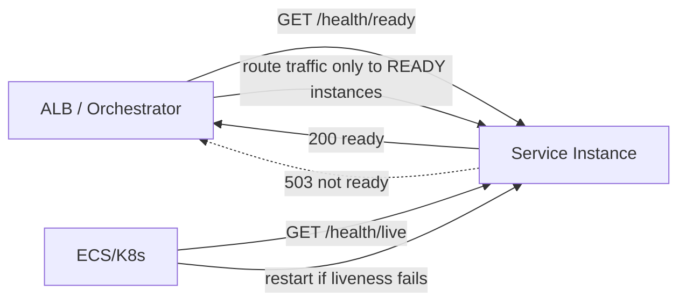

# Health Check Pattern

## What it is
Services expose **health endpoints** that the platform (load balancer, ECS/Kubernetes) polls to decide whether an instance should receive traffic or be restarted. The key distinction is **liveness** (is the process alive? if not, restart it) vs **readiness** (can it serve traffic right now? if not, stop routing to it — but don't restart).

## Flow diagram


## When to use
- **Always**, for any service behind a load balancer or orchestrator (ECS, EKS, ASG).
- Required for **zero-downtime deploys**, autoscaling, and auto-recovery.

## How to use with Node.js

### Separate liveness and readiness
```ts
import express from 'express';
const app = express();
let isShuttingDown = false;

// LIVENESS: is the event loop responsive? Keep it cheap. NO dependency checks.
app.get('/health/live', (_req, res) => res.status(200).json({ status: 'alive' }));

// READINESS: can we serve traffic? Reflect shutdown + (tolerant) dependency health.
app.get('/health/ready', async (_req, res) => {
  if (isShuttingDown) return res.status(503).json({ status: 'draining' });
  const checks = await Promise.allSettled([pingDb(), pingRedis()]);
  const dbOk = checks[0].status === 'fulfilled';
  // DB is critical -> not ready without it; Redis degraded -> still ready (serve w/o cache).
  return res.status(dbOk ? 200 : 503).json({
    status: dbOk ? 'ready' : 'unready',
    db: dbOk ? 'up' : 'down',
    cache: checks[1].status === 'fulfilled' ? 'up' : 'degraded',
  });
});

const server = app.listen(3000);

// Flip readiness to false on shutdown so the LB drains us BEFORE we exit.
process.on('SIGTERM', () => {
  isShuttingDown = true;
  server.close(() => process.exit(0));
});
```

### Wire-up
- **ALB target group** health check → `/health/ready`.
- **ECS/Kubernetes** liveness probe → `/health/live`; readiness probe → `/health/ready`.
- **NestJS:** `@nestjs/terminus` provides ready-made health indicators (DB, Redis, disk, custom).

## Pros
- Enables **auto-recovery** (restart dead instances) and **safe routing** (skip unhealthy ones).
- Foundation for **zero-downtime deploys** (drain before exit) and autoscaling.
- Surfaces dependency problems quickly.

## Cons
- **Badly designed checks cause outages:** an over-strict readiness check tied to a shared dependency can mark the **whole fleet** unready at once (correlated failure).
- Too-frequent/expensive checks add load.
- Liveness that checks dependencies causes **unnecessary restarts** on transient blips.

## Real-time use cases
- ECS service behind an ALB: only tasks passing `/health/ready` get traffic; failing tasks are replaced.
- Rolling deploy: new tasks must report ready before old ones drain → no dropped requests.
- A service that marks itself "not ready" while warming a cache on startup.

## Lead-level notes
- **Liveness ≠ readiness** — conflating them is a classic mistake. Liveness failing → restart; readiness failing → stop routing (no restart).
- Keep **liveness cheap and dependency-free**; make **readiness dependency checks tolerant** (degrade rather than hard-fail on non-critical deps) to avoid taking down the whole fleet on a transient DB hiccup.
- Tie readiness to **graceful shutdown** (flip to 503 on SIGTERM) for zero-downtime deploys.
- Cache health-check results briefly so probes don't hammer dependencies under load.
- Use **`@nestjs/terminus`** for standardized checks.
