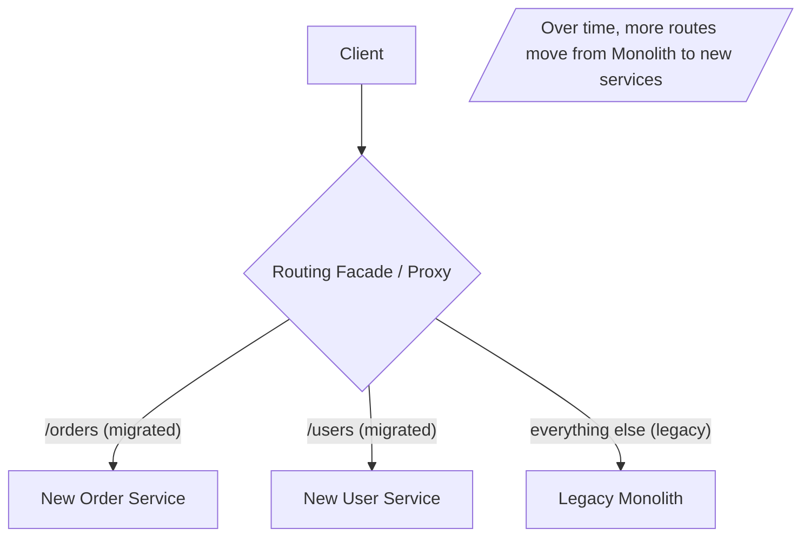

# Strangler Fig Pattern

## What it is
A strategy for **incrementally migrating a monolith to microservices** (or any rewrite) without a risky big-bang cutover. Named after a vine that grows around a tree and gradually replaces it: you put a routing facade in front of the monolith, peel off one capability at a time into a new service, route that traffic to the new service, and repeat until the monolith is "strangled" and can be retired.

## Flow diagram


## When to use
- You have a **large legacy monolith** that's risky/slow to change, and want to modernize **incrementally**.
- A full rewrite is too risky (big-bang rewrites famously fail).
- You want each migration step to be **small, reversible, and independently shippable**.

## When NOT to use
- The system is small enough to rewrite safely, or doesn't need decomposing at all.
- You can't insert a routing facade or can't run old + new side by side.

## How to use with Node.js

### 1) Put a facade/proxy in front (route by path)
```ts
import express from 'express';
import { createProxyMiddleware } from 'http-proxy-middleware';
const app = express();

// Migrated capabilities -> new services
app.use('/orders', createProxyMiddleware({ target: process.env.NEW_ORDER_SVC!, changeOrigin: true }));
app.use('/users',  createProxyMiddleware({ target: process.env.NEW_USER_SVC!,  changeOrigin: true }));

// Everything else still goes to the legacy monolith
app.use('/', createProxyMiddleware({ target: process.env.LEGACY_MONOLITH!, changeOrigin: true }));

app.listen(8080);
// On AWS this facade is often API Gateway/ALB routing rules or CloudFront behaviors.
```

### 2) Migrate incrementally with canary + fallback
```ts
// Route a % of traffic to the new service; fall back to legacy on error.
app.use('/orders', async (req, res, next) => {
  const useNew = Math.random() < Number(process.env.NEW_ORDERS_PERCENT ?? '0'); // ramp 1% -> 100%
  const target = useNew ? process.env.NEW_ORDER_SVC! : process.env.LEGACY_MONOLITH!;
  proxyTo(target, req, res, (err) => useNew ? proxyTo(process.env.LEGACY_MONOLITH!, req, res, next) : next());
});
```

### 3) Decouple the data last (the hard part)
- Start by extracting the service but **reading/writing the monolith's DB** temporarily.
- Then split data ownership: new service gets its own DB; sync via **events / CDC / outbox** during transition; accept eventual consistency.

## Pros
- **Low risk** — small, reversible steps; legacy keeps running throughout.
- **Incremental value** — ship and learn continuously instead of waiting years.
- Easy **rollback** — route back to the monolith if a new service misbehaves.
- Avoids the classic **failed big-bang rewrite**.

## Cons
- The **facade** is critical infrastructure (must be HA).
- You run **two systems in parallel** for a while (cost, complexity, duplicate logic).
- **Data decoupling is hard** — shared databases are the stickiest part.
- Migrations can **stall** half-done if not driven to completion.

## Real-time use cases
- Breaking a legacy e-commerce monolith apart: extract `orders`, then `payments`, then `catalog`, route-by-route.
- Modernizing a legacy API behind API Gateway, moving endpoints to Lambda/Fargate services one at a time.

## Lead-level notes
- This is the **standard, low-risk migration approach** — name it whenever someone proposes a rewrite.
- A well-structured **NestJS modular monolith** makes extraction easier (modules map to services).
- The **database split** (using events/CDC/outbox + eventual consistency) is where most migrations get hard — plan it explicitly.
- Migrate traffic with **canary/percentage routing + fallback** and watch SLOs; have a clear "decommission the monolith" finish line so it doesn't stall.
- Challenge the premise: sometimes the right destination is a **modular monolith**, not microservices.
