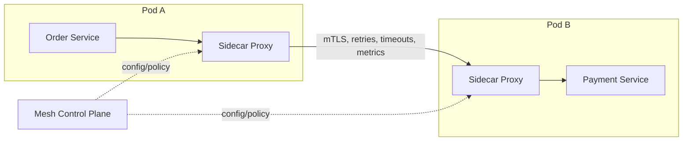

# Sidecar / Service Mesh Pattern

## What it is
A **sidecar** is a helper container deployed alongside your service container (same pod/task) that handles **cross-cutting concerns** — networking, security, observability — so your application code doesn't have to. A **service mesh** (Istio, Linkerd, AWS App Mesh) is a fleet of sidecar proxies (e.g., Envoy) plus a control plane that together manage **service-to-service communication** uniformly: mTLS, retries, timeouts, circuit breaking, traffic shifting, and telemetry — all configured centrally, outside your code.

## Flow diagram


## When to use
- You have **many services** and want consistent networking/security/observability **without changing each service's code**.
- You need **mTLS everywhere**, uniform retries/timeouts/circuit breaking, and traffic shifting (canary) as platform features.
- Polyglot environment (services in different languages) needing the same networking behavior.

## When NOT to use
- A handful of services — a mesh's operational complexity (and latency/resource overhead) isn't worth it.
- Serverless-first (Lambda) architectures where the mesh model doesn't fit cleanly.
- Small teams without the capacity to operate a mesh.

## How it relates to Node.js
With a mesh, you **remove** a lot of resilience/networking code from your Node services and let the proxy handle it:

```ts
// WITHOUT a mesh: each Node service implements retries, timeouts, mTLS, circuit breaking in code.
const res = await retry(() => breaker.fire(() =>
  fetch(`${PAY_SVC}/charge`, { signal: AbortSignal.timeout(2000) })));

// WITH a mesh: the sidecar proxy applies retries/timeouts/mTLS/circuit-breaking per central policy.
const res = await fetch('http://payment/charge'); // plain call; proxy handles resilience + security
```
Common sidecars you'll still see in Node deployments even without a full mesh:
- **AWS X-Ray daemon / ADOT collector** sidecar for tracing/metrics.
- **Envoy** (via **AWS App Mesh**) for traffic management.
- Log shippers / secrets agents as sidecars.

## Pros
- **Cross-cutting concerns out of app code** — consistent across all services and languages.
- **Uniform security** (mTLS, authz) and **traffic control** (canary, retries, timeouts, circuit breaking) configured centrally.
- Rich **telemetry** (latency, error rates, traces) for free at the proxy.
- App teams focus on business logic.

## Cons
- **Operational complexity** — a mesh is a significant system to run/upgrade.
- **Latency + resource overhead** — every call goes through a proxy; each pod runs an extra container.
- **Steep learning curve**; can be overkill for small systems.
- Another layer to debug when things go wrong.

## Real-time use cases
- A large EKS platform with dozens of services standardizing **mTLS + canary deploys + retries** via Istio/App Mesh.
- Adding **tracing/metrics** to every service uniformly via an ADOT/X-Ray sidecar without code changes.
- A polyglot org wanting identical networking behavior across Node, Java, and Go services.

## Lead-level notes
- The mesh moves resilience patterns (**retry, timeout, circuit breaker** — files 11/12) from **code to infrastructure**. That's a trade-off: less code, but more platform complexity and an extra network hop.
- On AWS: **App Mesh** (Envoy-based) for ECS/EKS; on Kubernetes, **Istio/Linkerd** are common.
- For small/medium systems, **library-level resilience** (opossum + retry) is usually simpler than a full mesh — adopt a mesh when service count and consistency needs justify it.
- Even without a mesh, **sidecars** (tracing collector, log shipper, secrets agent) are a clean way to offload cross-cutting concerns from your Node app.
