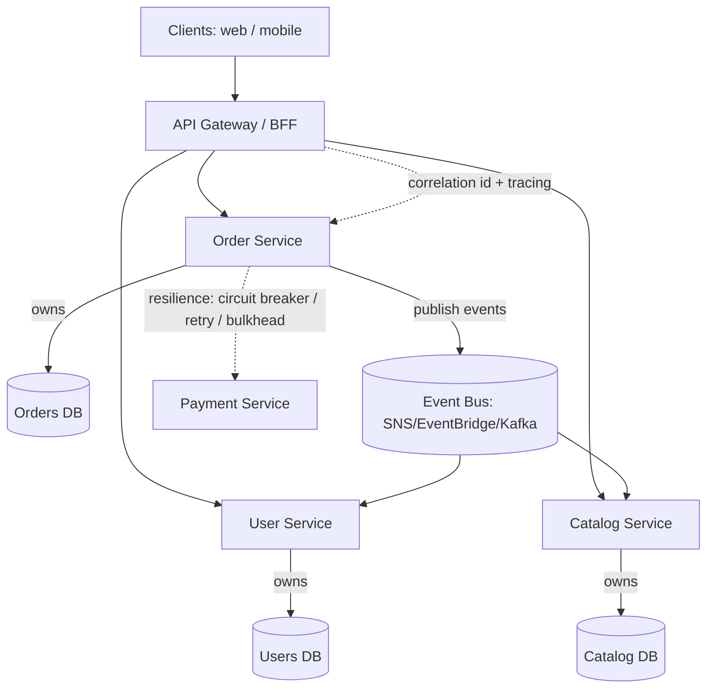

# Microservices with Node.js — Patterns

A pattern-by-pattern guide to building microservices with **Node.js / NestJS / Express** on **AWS**. Each file covers: **What it is → Flow diagram → When to use (and when not) → How to use with Node.js (code) → Pros & Cons → Real-time use cases → Lead-level notes.**

> Diagrams use **Mermaid**, which renders natively on GitHub. Code targets Node.js 18+, NestJS/Express, and AWS SDK v3.

## Patterns

### Decomposition & Communication
| # | Pattern | One-liner | File |
|---|---------|-----------|------|
| 1 | **API Gateway** | Single entry point that routes/cross-cuts to services | [01-api-gateway.md](./01-api-gateway.md) |
| 2 | **Backend for Frontend (BFF)** | A tailored gateway per client type | [02-backend-for-frontend.md](./02-backend-for-frontend.md) |
| 3 | **Service Discovery** | Find service instances dynamically | [03-service-discovery.md](./03-service-discovery.md) |
| 4 | **API Composition / Aggregator** | Combine data from several services into one response | [04-api-composition-aggregator.md](./04-api-composition-aggregator.md) |
| 5 | **Async Messaging / Event-Driven** | Services communicate via events/queues | [05-async-messaging-event-driven.md](./05-async-messaging-event-driven.md) |

### Data Management
| # | Pattern | One-liner | File |
|---|---------|-----------|------|
| 6 | **Database per Service** | Each service owns its data store | [06-database-per-service.md](./06-database-per-service.md) |
| 7 | **Saga** | Distributed transactions via local steps + compensation | [07-saga.md](./07-saga.md) |
| 8 | **CQRS** | Separate read and write models | [08-cqrs.md](./08-cqrs.md) |
| 9 | **Event Sourcing** | Store state as a sequence of events | [09-event-sourcing.md](./09-event-sourcing.md) |
| 10 | **Transactional Outbox** | Atomically persist data + publish events | [10-transactional-outbox.md](./10-transactional-outbox.md) |

### Resilience
| # | Pattern | One-liner | File |
|---|---------|-----------|------|
| 11 | **Circuit Breaker** | Fail fast when a dependency is unhealthy | [11-circuit-breaker.md](./11-circuit-breaker.md) |
| 12 | **Retry with Backoff & Jitter** | Retry transient failures safely | [12-retry-backoff.md](./12-retry-backoff.md) |
| 13 | **Bulkhead** | Isolate resource pools to contain failures | [13-bulkhead.md](./13-bulkhead.md) |

### Cross-Cutting & Operational
| # | Pattern | One-liner | File |
|---|---------|-----------|------|
| 14 | **Distributed Tracing & Correlation ID** | Follow a request across services | [14-distributed-tracing.md](./14-distributed-tracing.md) |
| 15 | **Health Check** | Liveness/readiness probes for orchestration | [15-health-check.md](./15-health-check.md) |
| 16 | **Strangler Fig** | Incrementally migrate a monolith | [16-strangler-fig.md](./16-strangler-fig.md) |
| 17 | **Sidecar / Service Mesh** | Offload cross-cutting concerns to a proxy | [17-sidecar-service-mesh.md](./17-sidecar-service-mesh.md) |

## How these fit together (big picture)

## Lead-level framing
- **Don't start with microservices.** A well-structured **modular monolith** (e.g., NestJS feature modules) is often the right first step. Split only when team size, scaling needs, or independent deployability justify the operational cost (network failures, eventual consistency, distributed debugging).
- **The hard part is data**, not code — `Database per Service` + `Saga`/`Outbox` + eventual consistency are where most designs succeed or fail.
- **Resilience is mandatory:** every cross-service call needs timeouts + retries (backoff/jitter) + a circuit breaker, plus idempotency.
- **Observability is non-negotiable:** correlation IDs + distributed tracing from day one.

## Related material in this repo
- AWS reference pack: [../aws/README.md](../aws/README.md)
- Practical AWS+Node usage: [../practical-usecases/README.md](../practical-usecases/README.md)
- Deep-dive interview guide: [../guide/AWS-NodeJS-Lead-Interview-100-Questions.md](../guide/AWS-NodeJS-Lead-Interview-100-Questions.md)
