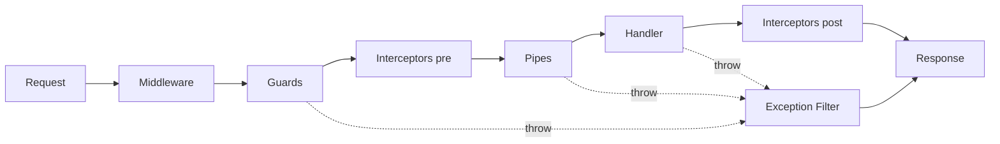

# NestJS Request Lifecycle — Interview Questions

[← Back to index](./README.md)

> **The execution order (memorize this):**
> **Incoming request → Middleware → Guards → Interceptors (pre) → Pipes → Route Handler → Interceptors (post) → Exception Filters (on error) → Response**



---

### Q1. Compare middleware, guards, pipes, interceptors, and exception filters. When do you use each?

**Answer.**
- **Middleware** — runs first, has access to raw `req`/`res`/`next`. Use for: logging, request-id/correlation, helmet, body parsing, CORS. No access to the execution context's handler metadata.
- **Guards** — return `boolean` (or throw) to **allow/deny** a request. Use for **authentication/authorization**. Run after middleware, before interceptors/pipes. Integrate with route metadata via `Reflector`.
- **Interceptors** — wrap the handler (AOP-style, RxJS-based). Use for: transforming responses, caching, logging timing, timeouts, serialization. Run **before and after** the handler.
- **Pipes** — **transform and validate** input (e.g., `ValidationPipe`, `ParseIntPipe`). Run just before the handler receives arguments.
- **Exception filters** — catch thrown exceptions and produce a consistent error response. Run when anything in the chain throws.

**Lead-level note:** Choosing the right primitive is the signal. E.g., **auth belongs in a guard** (not middleware) so it runs after route matching and can read `@Roles()` metadata; **validation belongs in a pipe**; **response shaping belongs in an interceptor**.

---

### Q2. What is the exact execution order, and why does it matter?

**Answer.** Middleware → Guards → Interceptors (pre) → Pipes → Handler → Interceptors (post) → Exception filters (on throw). It matters because it determines where to put logic:
- Auth (guard) runs **before** validation (pipe) — no point validating a body for an unauthorized user.
- Interceptors wrap pipes+handler, so a timing interceptor measures the whole handler execution.
- A guard throwing `ForbiddenException` is caught by the exception filter and returns a clean 403.

**Lead-level note:** Knowing the order distinguishes seniors. A classic gotcha: people try to do authorization in middleware and lose access to route metadata/DI.

---

### Q3. How do you implement authentication and authorization with guards?

**Answer.** Authentication via a guard (often Passport-backed); authorization via a roles/permissions guard reading metadata.

```ts
@Injectable()
export class JwtAuthGuard implements CanActivate {
  async canActivate(ctx: ExecutionContext): Promise<boolean> {
    const req = ctx.switchToHttp().getRequest();
    const token = req.headers.authorization?.split(' ')[1];
    const payload = await verifyJwt(token);     // throws -> 401 via filter
    req.user = payload;
    return true;
  }
}

@Roles('admin')
@UseGuards(JwtAuthGuard, RolesGuard)  // authn first, then authz
@Get('admin/users')
listUsers() {}
```

**Lead-level note:** Apply `JwtAuthGuard` globally (`APP_GUARD`) and use a `@Public()` decorator to opt out specific routes; keep coarse auth at the edge (API Gateway/Cognito) and fine-grained checks in guards.

---

### Q4. How do interceptors work, and what are common use cases (with RxJS)?

**Answer.** Interceptors implement `intercept(ctx, next)` and operate on the handler's **RxJS stream** via `next.handle()`. They can run logic before and transform the result after.

```ts
@Injectable()
export class TransformInterceptor implements NestInterceptor {
  intercept(ctx: ExecutionContext, next: CallHandler): Observable<any> {
    const now = Date.now();
    return next.handle().pipe(
      map((data) => ({ data, meta: { ms: Date.now() - now } })),   // wrap response
      timeout(5000),                                                // enforce a timeout
    );
  }
}
```
Common uses: response envelope/transformation, caching (`CacheInterceptor`), logging/metrics, timeouts, and serialization (`ClassSerializerInterceptor`).

**Lead-level note:** Interceptors are Nest's AOP mechanism. `ClassSerializerInterceptor` + `@Exclude()` is the standard way to strip sensitive fields from responses.

---

### Q5. How do pipes work for validation and transformation?

**Answer.** A pipe implements `transform(value, metadata)`; it can validate (throw on invalid) or transform (coerce types). Built-ins: `ValidationPipe`, `ParseIntPipe`, `ParseUUIDPipe`, `DefaultValuePipe`.

```ts
@Get(':id') findOne(@Param('id', ParseIntPipe) id: number) {} // coerces & validates "id"

// Global validation with DTOs
app.useGlobalPipes(new ValidationPipe({ whitelist: true, transform: true, forbidNonWhitelisted: true }));
```

**Lead-level note:** `transform: true` turns plain payloads into DTO **class instances** (so `class-validator`/`class-transformer` decorators work) and coerces primitive types. `whitelist` is a security control (prevents mass-assignment).

---

### Q6. How do exception filters provide consistent error handling?

**Answer.** A `@Catch()` filter intercepts thrown exceptions and shapes the HTTP response. A global filter gives every error a consistent structure + logging.

```ts
@Catch()
export class AllExceptionsFilter implements ExceptionFilter {
  catch(exception: unknown, host: ArgumentsHost) {
    const res = host.switchToHttp().getResponse();
    const status = exception instanceof HttpException ? exception.getStatus() : 500;
    const message = status < 500 && exception instanceof HttpException ? exception.getResponse() : 'Internal server error';
    // log full detail server-side with correlation id; return safe message to client
    res.status(status).json({ statusCode: status, message, timestamp: new Date().toISOString() });
  }
}
// app.useGlobalFilters(new AllExceptionsFilter());
```

**Lead-level note:** Never leak stack traces/internal messages to clients on 5xx. Log full detail with a correlation ID; return a generic message. Nest's built-in `HttpException` hierarchy (`NotFoundException`, etc.) gives correct status codes for free.

---

### Q7. How do you apply guards/pipes/interceptors/filters globally vs locally?

**Answer.** Three scopes:
- **Method-level:** `@UseGuards(X)` on a handler.
- **Controller-level:** `@UseGuards(X)` on the class.
- **Global:** `app.useGlobalGuards(...)` **or** (preferred, DI-enabled) provider tokens:

```ts
@Module({ providers: [{ provide: APP_GUARD, useClass: JwtAuthGuard }] })
export class AppModule {}
```

**Lead-level note:** Registering globals via `APP_GUARD`/`APP_PIPE`/`APP_INTERCEPTOR`/`APP_FILTER` tokens lets them use **dependency injection** (unlike `app.useGlobalX(new X())`). That's the idiomatic way for globals that need injected deps.

---

### Q8. What is `ExecutionContext` and why is it useful?

**Answer.** `ExecutionContext` is an abstraction over the current request context that works across transports (HTTP, WebSockets, microservices/RPC, GraphQL). It lets a guard/interceptor get the handler, class, and the underlying request regardless of protocol.

```ts
canActivate(ctx: ExecutionContext) {
  if (ctx.getType() === 'http') { const req = ctx.switchToHttp().getRequest(); }
  else if (ctx.getType() === 'ws') { const client = ctx.switchToWs().getClient(); }
  const handler = ctx.getHandler(); // for Reflector metadata
}
```

**Lead-level note:** This is what makes a single guard/interceptor reusable across HTTP and WebSocket/microservice transports.

---

### Q9. How do you create and use custom decorators (param + metadata)?

**Answer.** Two kinds:
- **Param decorator** (`createParamDecorator`) — extract data into a handler argument.
- **Metadata decorator** (`SetMetadata`) — attach metadata read later by a guard/interceptor.

```ts
export const CurrentUser = createParamDecorator((_d, ctx: ExecutionContext) =>
  ctx.switchToHttp().getRequest().user);

export const Roles = (...roles: string[]) => SetMetadata('roles', roles);

@Get('me') me(@CurrentUser() user: User) { return user; }
```

You can also compose decorators with `applyDecorators()` (e.g., a single `@Auth('admin')` that bundles `@UseGuards()` + `@Roles()` + Swagger docs).

---

### Q10. Where would you put logging, correlation IDs, and request timing?

**Answer.**
- **Correlation ID** → **middleware** (runs first; store in `AsyncLocalStorage` so every log line and downstream call includes it).
- **Request/response logging & timing** → an **interceptor** (wraps the handler, can measure duration and log the result).
- **Error logging** → the **exception filter** (single place to log failures with the correlation ID).

**Lead-level note:** Using `AsyncLocalStorage` for the correlation ID avoids threading it through every function and is the modern, clean approach for request-scoped context (and avoids the cost of `Scope.REQUEST` providers).
