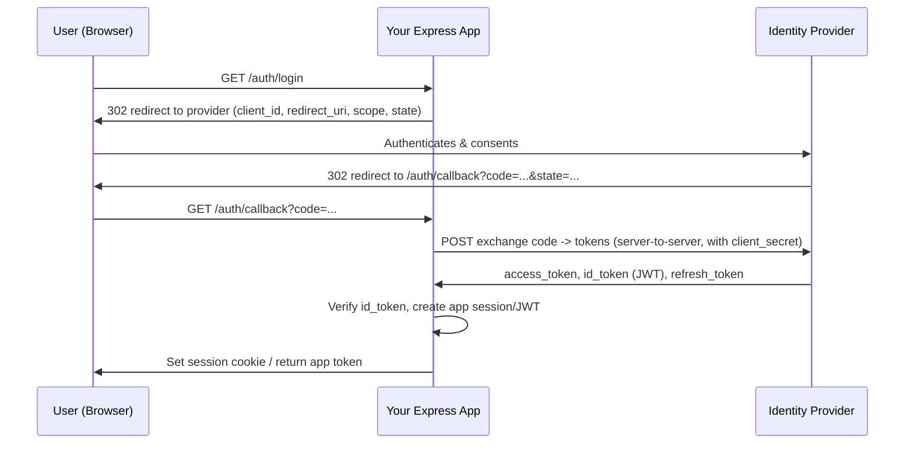

# SSO (Single Sign-On) with Node.js + Express

Full, practical implementation guides for adding **Single Sign-On** to a Node.js/Express REST API using the major identity providers. Each guide covers the provider console setup, the OAuth2/OIDC flow, **complete Express code**, token verification, session/JWT handling, logout, and security/production notes.

## Guides

| Provider | What it uses | File |
|----------|--------------|------|
| **Google SSO** | Google OAuth 2.0 / OpenID Connect | [google-sso-node-express.md](./google-sso-node-express.md) |
| **AWS SSO** | Amazon Cognito (Hosted UI / OIDC) + note on IAM Identity Center | [aws-sso-node-express.md](./aws-sso-node-express.md) |
| **Azure SSO** | Microsoft Entra ID (Azure AD) via MSAL / OIDC | [azure-sso-node-express.md](./azure-sso-node-express.md) |
| **Facebook SSO** | Facebook Login (OAuth 2.0) | [facebook-sso-node-express.md](./facebook-sso-node-express.md) |

## Shared concepts (read this first)

### OAuth 2.0 Authorization Code flow (used by all four)

### Key terms
- **OAuth 2.0** — authorization framework (delegated access). **OIDC** — an identity layer on top of OAuth2 that adds an **`id_token`** (a JWT with the user's identity).
- **Authorization Code flow** — the secure server-side flow (the one to use for web apps). The browser never sees the `client_secret`.
- **PKCE** — Proof Key for Code Exchange; required for public clients (SPAs/mobile), recommended everywhere.
- **`state`** — anti-CSRF random value echoed back on the callback (always validate it).
- **`nonce`** — anti-replay value bound into the `id_token` (OIDC).
- **Scopes** — what you request (`openid email profile`).

### Two implementation styles you'll see here
1. **Passport.js strategy** — least code for Google/Facebook (mature strategies).
2. **Manual / standards-based (openid-client, MSAL, aws-jwt-verify)** — more control, fewer deps, clearer for interviews.

### Security checklist (applies to every provider)
- Always use the **Authorization Code flow** (not implicit); add **PKCE**.
- Validate **`state`** (CSRF) and **`nonce`** (replay) on the callback.
- Keep **`client_secret`** server-side only (Secrets Manager/SSM on AWS — never in client code or git).
- **Verify the `id_token`** signature (JWKS), `iss`, `aud`, `exp`.
- Use `HttpOnly`, `Secure`, `SameSite` cookies for the session; HTTPS everywhere.
- Request **least-privilege scopes**; store only what you need.
- Implement **logout** (clear local session + provider logout where supported).

## Related material
- JWT auth in Express: [../code-examples/03-auth-jwt.md](../code-examples/03-auth-jwt.md)
- NestJS auth (guards/Passport): [../../nestjs/interview-questions/03-request-lifecycle.md](../../nestjs/interview-questions/03-request-lifecycle.md)
- Cognito on AWS: [../../practical-usecases/03-amazon-api-gateway.md](../../practical-usecases/03-amazon-api-gateway.md)
