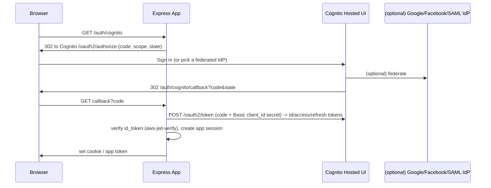

# AWS SSO with Node.js + Express — Full Implementation

[← Back to SSO index](./README.md)

> **Naming clarity:** "AWS SSO" can mean two things:
> - **Amazon Cognito** — the standard way to add SSO/login (and social/enterprise federation) to your **application's end users**. ← *This is what app developers mean and what we implement here.*
> - **AWS IAM Identity Center** (formerly "AWS SSO") — workforce SSO for accessing the **AWS Console/CLI and SAML apps** (not app end-user login). Covered briefly at the end.

We'll implement **Amazon Cognito Hosted UI** (OAuth2/OIDC) with Node + Express, two ways: (A) manual OIDC code exchange + **`aws-jwt-verify`**, and (B) **Passport** via `openid-client`.

---

## 1. Provider setup (Amazon Cognito)

1. **Create a User Pool** (Cognito → User pools).
2. Add an **App client** (no client secret for SPA/PKCE; *with* secret for a confidential server app — we use a secret here).
3. Configure a **Hosted UI domain** (e.g., `myapp.auth.us-east-1.amazoncognito.com`).
4. Under **App client → Hosted UI**:
   - Allowed callback URL: `http://localhost:3000/auth/cognito/callback` (+ prod).
   - Allowed sign-out URL: `http://localhost:3000/`.
   - OAuth grant: **Authorization code grant**.
   - Scopes: `openid email profile`.
5. (Optional) Add **federation** to Google/Facebook/SAML/OIDC IdPs in the User Pool → Cognito brokers them (true SSO across providers).

```bash
# .env
COGNITO_REGION=us-east-1
COGNITO_USER_POOL_ID=us-east-1_xxxxxxx
COGNITO_CLIENT_ID=xxxxxxxxxxxxxxxxx
COGNITO_CLIENT_SECRET=xxxxxxxx
COGNITO_DOMAIN=https://myapp.auth.us-east-1.amazoncognito.com
COGNITO_CALLBACK_URL=http://localhost:3000/auth/cognito/callback
COGNITO_LOGOUT_URL=http://localhost:3000/
```

```bash
npm i express express-session aws-jwt-verify jsonwebtoken
# Approach B: npm i openid-client
```

---

## 2. Flow (Cognito Hosted UI brokers the login)



---

## Approach A — Manual OIDC + `aws-jwt-verify` (official verifier)

```js
const express = require('express');
const crypto = require('crypto');
const { CognitoJwtVerifier } = require('aws-jwt-verify');
const router = express.Router();

const {
  COGNITO_DOMAIN, COGNITO_CLIENT_ID, COGNITO_CLIENT_SECRET,
  COGNITO_CALLBACK_URL, COGNITO_USER_POOL_ID, COGNITO_LOGOUT_URL,
} = process.env;

// Official Cognito JWT verifier (handles JWKS, iss, aud, exp, token_use)
const idVerifier = CognitoJwtVerifier.create({
  userPoolId: COGNITO_USER_POOL_ID,
  clientId: COGNITO_CLIENT_ID,
  tokenUse: 'id',
});

// 1) Redirect to Cognito Hosted UI
router.get('/auth/cognito', (req, res) => {
  const state = crypto.randomBytes(16).toString('hex');
  req.session.state = state;
  const url = new URL(`${COGNITO_DOMAIN}/oauth2/authorize`);
  url.search = new URLSearchParams({
    response_type: 'code',
    client_id: COGNITO_CLIENT_ID,
    redirect_uri: COGNITO_CALLBACK_URL,
    scope: 'openid email profile',
    state,
  }).toString();
  res.redirect(url.toString());
});

// 2) Callback: validate state, exchange code, verify id_token
router.get('/auth/cognito/callback', async (req, res, next) => {
  try {
    const { code, state } = req.query;
    if (!code || state !== req.session.state) return res.status(400).json({ error: 'invalid_state' });

    // Exchange code for tokens (confidential client -> HTTP Basic auth header)
    const basic = Buffer.from(`${COGNITO_CLIENT_ID}:${COGNITO_CLIENT_SECRET}`).toString('base64');
    const tokenRes = await fetch(`${COGNITO_DOMAIN}/oauth2/token`, {
      method: 'POST',
      headers: { 'Content-Type': 'application/x-www-form-urlencoded', Authorization: `Basic ${basic}` },
      body: new URLSearchParams({
        grant_type: 'authorization_code',
        client_id: COGNITO_CLIENT_ID,
        code,
        redirect_uri: COGNITO_CALLBACK_URL,
      }),
    });
    if (!tokenRes.ok) throw new Error('token_exchange_failed');
    const tokens = await tokenRes.json(); // { id_token, access_token, refresh_token, expires_in }

    // Verify the id_token (signature/iss/aud/exp/token_use) and read claims
    const claims = await idVerifier.verify(tokens.id_token);
    const user = await upsertUser({
      provider: 'cognito',
      providerId: claims.sub,
      email: claims.email,
      groups: claims['cognito:groups'] || [],
    });

    req.session.user = { id: user.id, email: user.email, refreshToken: tokens.refresh_token };
    res.redirect(process.env.FRONTEND_URL || '/');
  } catch (err) { next(err); }
});

module.exports = router;
```

### Protecting API routes (verify Cognito access token directly)

```js
const accessVerifier = CognitoJwtVerifier.create({
  userPoolId: COGNITO_USER_POOL_ID, clientId: COGNITO_CLIENT_ID, tokenUse: 'access',
});
async function requireCognito(req, res, next) {
  try {
    const token = req.headers.authorization?.replace('Bearer ', '');
    req.user = await accessVerifier.verify(token);   // throws if invalid
    next();
  } catch { res.status(401).json({ error: 'unauthorized' }); }
}
```

---

## Approach B — Passport via `openid-client` (OIDC discovery)

```js
const { Issuer } = require('openid-client');
const cognitoIssuer = await Issuer.discover(
  `https://cognito-idp.${process.env.COGNITO_REGION}.amazonaws.com/${process.env.COGNITO_USER_POOL_ID}`,
);
const client = new cognitoIssuer.Client({
  client_id: process.env.COGNITO_CLIENT_ID,
  client_secret: process.env.COGNITO_CLIENT_SECRET,
  redirect_uris: [process.env.COGNITO_CALLBACK_URL],
  response_types: ['code'],
});
// then use client.authorizationUrl({ scope, state, nonce }) and client.callback(...) like the Google manual example
```

---

## Logout (Cognito has a logout endpoint)

```js
router.post('/auth/logout', (req, res) => {
  req.session.destroy(() => {});                       // clear local session
  const url = new URL(`${process.env.COGNITO_DOMAIN}/logout`);
  url.search = new URLSearchParams({
    client_id: process.env.COGNITO_CLIENT_ID,
    logout_uri: process.env.COGNITO_LOGOUT_URL,
  }).toString();
  res.redirect(url.toString());                        // also ends the Cognito session
});
```

---

## Refresh tokens

```js
// Exchange a refresh_token for new id/access tokens (grant_type=refresh_token)
async function refresh(refreshToken) {
  const basic = Buffer.from(`${COGNITO_CLIENT_ID}:${COGNITO_CLIENT_SECRET}`).toString('base64');
  const r = await fetch(`${COGNITO_DOMAIN}/oauth2/token`, {
    method: 'POST',
    headers: { 'Content-Type': 'application/x-www-form-urlencoded', Authorization: `Basic ${basic}` },
    body: new URLSearchParams({ grant_type: 'refresh_token', client_id: COGNITO_CLIENT_ID, refresh_token: refreshToken }),
  });
  return r.json();
}
```

---

## Security & production notes
- Use **`aws-jwt-verify`** (official) — it caches JWKS and validates `iss`, `aud`, `exp`, and **`token_use`** (`id` vs `access`).
- Keep **client secret** in **Secrets Manager/SSM**; for SPAs use a **public client + PKCE** (no secret).
- Validate **`state`**; add **PKCE** for extra protection.
- Cognito can **federate** Google/Facebook/SAML/OIDC — your app integrates **once** with Cognito and gets all providers (true SSO hub). This is the big advantage of "AWS SSO via Cognito."
- On AWS: front with API Gateway (which has a built-in **Cognito authorizer**) so tokens are validated at the edge before hitting Express.

---

## Bonus — AWS IAM Identity Center (formerly "AWS SSO")
If the question means **workforce SSO** (employees signing into the AWS Console/CLI or SAML/OIDC business apps):
- **IAM Identity Center** is a SAML 2.0 / OIDC identity source for AWS accounts and integrated apps — *not* for end-user app login.
- For a Node app, you'd integrate as a **SAML/OIDC service provider** (e.g., with `passport-saml` / `openid-client`) pointing at Identity Center as the IdP, or use the AWS SDK SSO credential provider for CLI/programmatic access.
- For end-user application login (the usual interview intent), **Cognito** above is the right answer.
