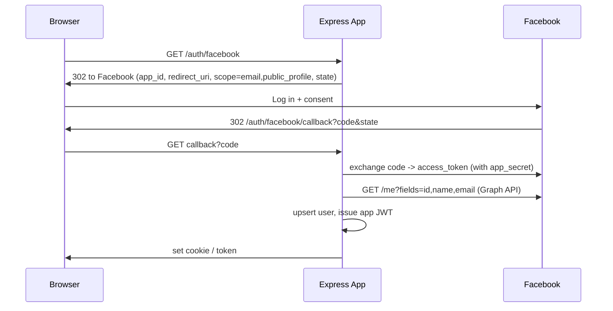

# Facebook SSO with Node.js + Express — Full Implementation

[← Back to SSO index](./README.md)

Facebook Login uses **OAuth 2.0** (not full OIDC by default — there's no standard `id_token`; you fetch the profile via the Graph API). We'll implement it two ways: (A) **Passport.js** (recommended), and (B) **manual** OAuth2 code exchange + Graph API.

---

## 1. Provider setup (Meta for Developers)

1. Go to **developers.facebook.com → My Apps → Create App** (type: *Consumer*).
2. Add the **Facebook Login** product.
3. Under **Facebook Login → Settings**, add **Valid OAuth Redirect URIs**: `http://localhost:3000/auth/facebook/callback` (+ prod URL).
4. From **App Settings → Basic**, copy **App ID** and **App Secret**.
5. Add required permissions: `email`, `public_profile` (email requires App Review for production).

```bash
# .env
FACEBOOK_APP_ID=xxxxxxxxxxxx
FACEBOOK_APP_SECRET=xxxxxxxx
FACEBOOK_CALLBACK_URL=http://localhost:3000/auth/facebook/callback
JWT_SECRET=long-random-string
```

```bash
npm i express passport passport-facebook express-session jsonwebtoken
```

---

## 2. Flow



---

## Approach A — Passport.js (recommended)

```js
// auth-facebook.js
const express = require('express');
const passport = require('passport');
const { Strategy: FacebookStrategy } = require('passport-facebook');
const jwt = require('jsonwebtoken');

passport.use(new FacebookStrategy(
  {
    clientID: process.env.FACEBOOK_APP_ID,
    clientSecret: process.env.FACEBOOK_APP_SECRET,
    callbackURL: process.env.FACEBOOK_CALLBACK_URL,
    profileFields: ['id', 'displayName', 'emails', 'photos'], // fields to fetch from Graph API
    state: true,                                              // CSRF protection
    enableProof: true,                                        // appsecret_proof — extra security
  },
  async (accessToken, refreshToken, profile, done) => {
    try {
      const user = await upsertUser({
        provider: 'facebook',
        providerId: profile.id,
        email: profile.emails?.[0]?.value,   // may be absent if user has no email / not granted
        name: profile.displayName,
        avatar: profile.photos?.[0]?.value,
      });
      done(null, user);
    } catch (err) { done(err); }
  },
));

const router = express.Router();

router.get('/auth/facebook',
  passport.authenticate('facebook', { scope: ['email', 'public_profile'], session: false }));

router.get('/auth/facebook/callback',
  passport.authenticate('facebook', { session: false, failureRedirect: '/login?error=facebook' }),
  (req, res) => {
    const token = jwt.sign(
      { sub: req.user.id, email: req.user.email, provider: 'facebook' },
      process.env.JWT_SECRET, { expiresIn: '15m' },
    );
    res.cookie('access_token', token, { httpOnly: true, secure: true, sameSite: 'lax' });
    res.redirect(process.env.FRONTEND_URL || '/');
  },
);

module.exports = router;
```

```js
// app.js
const app = require('express')();
const passport = require('passport');
app.use(passport.initialize());
app.use(require('./auth-facebook'));
app.listen(3000);
```

> `enableProof: true` adds the **`appsecret_proof`** (HMAC of the access token with your app secret) to Graph API calls — Facebook recommends this to harden against token theft.

---

## Approach B — Manual OAuth2 + Graph API

```js
const express = require('express');
const crypto = require('crypto');
const jwt = require('jsonwebtoken');
const router = express.Router();

const { FACEBOOK_APP_ID, FACEBOOK_APP_SECRET, FACEBOOK_CALLBACK_URL } = process.env;
const GRAPH = 'https://graph.facebook.com/v19.0';

// 1) Redirect to Facebook
router.get('/auth/facebook', (req, res) => {
  const state = crypto.randomBytes(16).toString('hex');
  req.session.fbState = state;
  const url = new URL('https://www.facebook.com/v19.0/dialog/oauth');
  url.search = new URLSearchParams({
    client_id: FACEBOOK_APP_ID,
    redirect_uri: FACEBOOK_CALLBACK_URL,
    scope: 'email,public_profile',
    state,
    response_type: 'code',
  }).toString();
  res.redirect(url.toString());
});

// 2) Callback: validate state -> exchange code -> fetch profile
router.get('/auth/facebook/callback', async (req, res, next) => {
  try {
    const { code, state } = req.query;
    if (!code || state !== req.session.fbState) return res.status(400).json({ error: 'invalid_state' });

    // Exchange code for an access token
    const tokenUrl = new URL(`${GRAPH}/oauth/access_token`);
    tokenUrl.search = new URLSearchParams({
      client_id: FACEBOOK_APP_ID,
      client_secret: FACEBOOK_APP_SECRET,
      redirect_uri: FACEBOOK_CALLBACK_URL,
      code,
    }).toString();
    const tokenRes = await fetch(tokenUrl).then((r) => r.json()); // { access_token, ... }
    const accessToken = tokenRes.access_token;

    // appsecret_proof to harden the Graph call
    const proof = crypto.createHmac('sha256', FACEBOOK_APP_SECRET).update(accessToken).digest('hex');

    // Fetch the user profile from the Graph API
    const profile = await fetch(
      `${GRAPH}/me?fields=id,name,email&access_token=${accessToken}&appsecret_proof=${proof}`,
    ).then((r) => r.json());

    const user = await upsertUser({ provider: 'facebook', providerId: profile.id, email: profile.email, name: profile.name });
    const token = jwt.sign({ sub: user.id, email: user.email }, process.env.JWT_SECRET, { expiresIn: '15m' });
    res.cookie('access_token', token, { httpOnly: true, secure: true, sameSite: 'lax' });
    res.redirect('/');
  } catch (err) { next(err); }
});

module.exports = router;
```

---

## Logout

```js
router.post('/auth/logout', (req, res) => {
  res.clearCookie('access_token');
  // Optionally revoke the FB token: DELETE {GRAPH}/{user-id}/permissions?access_token=...
  res.json({ ok: true });
});
```

---

## Security & production notes
- **Email isn't guaranteed** — a user may sign up without an email or not grant it; handle the missing-email case (prompt for one).
- Production access to the `email` permission requires **App Review** (and a Privacy Policy URL).
- Use **`appsecret_proof`** on Graph calls (Passport `enableProof: true`) to prevent stolen-token misuse.
- Validate **`state`** (CSRF); keep **App Secret** server-side (Secrets Manager/SSM on AWS).
- Store users keyed by Facebook **`id`** (`sub`); link accounts if the same person logs in via multiple providers (match on verified email).
- Facebook is OAuth2 (no standard `id_token`) — you trust the **server-to-server Graph API** call for identity, so always do the token exchange server-side.
- Cookies `HttpOnly`/`Secure`/`SameSite`; HTTPS only; short-lived app JWT + refresh.
