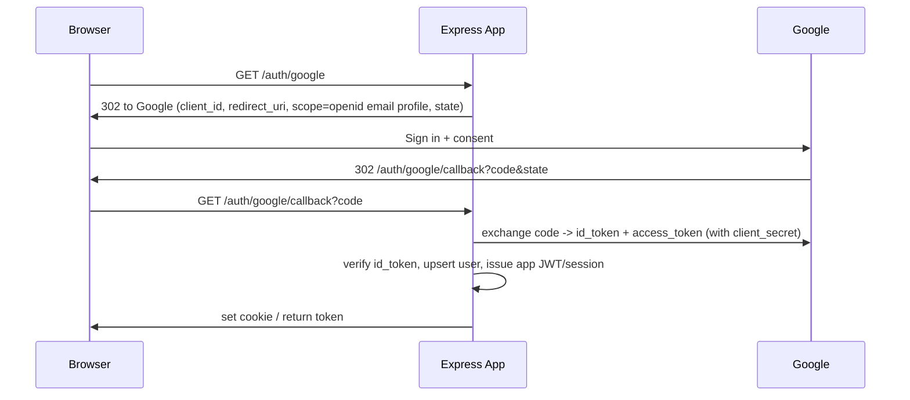

# Google SSO with Node.js + Express — Full Implementation

[← Back to SSO index](./README.md)

Google sign-in uses **OAuth 2.0 / OpenID Connect**. We'll implement it two ways: (A) with **Passport.js** (least code), and (B) **manually** with `openid-client` (more control, standards-based).

---

## 1. Provider setup (Google Cloud Console)

1. Go to **Google Cloud Console → APIs & Services → Credentials**.
2. Configure the **OAuth consent screen** (app name, support email, scopes: `email`, `profile`, `openid`).
3. Create **OAuth client ID** → type **Web application**.
4. Add **Authorized redirect URI**: `http://localhost:3000/auth/google/callback` (and your prod URL `https://api.example.com/auth/google/callback`).
5. Copy the **Client ID** and **Client Secret**.

```bash
# .env  (never commit; in prod use AWS Secrets Manager / SSM)
GOOGLE_CLIENT_ID=xxxx.apps.googleusercontent.com
GOOGLE_CLIENT_SECRET=xxxx
GOOGLE_CALLBACK_URL=http://localhost:3000/auth/google/callback
SESSION_SECRET=a-long-random-string
JWT_SECRET=another-long-random-string
```

```bash
npm i express passport passport-google-oauth20 express-session jsonwebtoken
# Approach B also: npm i openid-client
```

---

## 2. Flow



---

## Approach A — Passport.js (recommended for speed)

```js
// auth-google.js
const express = require('express');
const passport = require('passport');
const { Strategy: GoogleStrategy } = require('passport-google-oauth20');
const jwt = require('jsonwebtoken');

passport.use(new GoogleStrategy(
  {
    clientID: process.env.GOOGLE_CLIENT_ID,
    clientSecret: process.env.GOOGLE_CLIENT_SECRET,
    callbackURL: process.env.GOOGLE_CALLBACK_URL,
    scope: ['openid', 'email', 'profile'],
    state: true,                       // enable CSRF state automatically
  },
  // verify callback: Passport already exchanged the code & validated tokens
  async (accessToken, refreshToken, profile, done) => {
    try {
      // Upsert the user in YOUR database keyed by the Google sub (profile.id)
      const user = await upsertUser({
        provider: 'google',
        providerId: profile.id,
        email: profile.emails?.[0]?.value,
        name: profile.displayName,
        avatar: profile.photos?.[0]?.value,
      });
      return done(null, user);
    } catch (err) { return done(err); }
  },
));

const router = express.Router();

// 1) Kick off login
router.get('/auth/google', passport.authenticate('google', { session: false }));

// 2) Handle the callback, then issue YOUR app's JWT (stateless API)
router.get('/auth/google/callback',
  passport.authenticate('google', { session: false, failureRedirect: '/login?error=google' }),
  (req, res) => {
    const token = jwt.sign(
      { sub: req.user.id, email: req.user.email, provider: 'google' },
      process.env.JWT_SECRET,
      { expiresIn: '15m' },
    );
    // Option 1 (SPA): redirect with token in fragment or set an HttpOnly cookie
    res.cookie('access_token', token, { httpOnly: true, secure: true, sameSite: 'lax', maxAge: 15 * 60 * 1000 });
    res.redirect(process.env.FRONTEND_URL || '/');
  },
);

module.exports = router;
```

```js
// app.js
const express = require('express');
const passport = require('passport');
const app = express();
app.use(passport.initialize());     // stateless (no session) — we issue our own JWT
app.use(require('./auth-google'));

// Protect routes with your own JWT (see ../code-examples/03-auth-jwt.md)
app.get('/me', requireJwt, (req, res) => res.json(req.user));
app.listen(3000);
```

> `{ session: false }` means we don't use Passport's server-side session — we mint our **own stateless JWT** so the API scales horizontally. If you prefer server sessions, drop `session:false`, add `express-session`, and implement `serializeUser`/`deserializeUser`.

---

## Approach B — Manual with `openid-client` (standards-based, more control)

```js
const { Issuer, generators } = require('openid-client');
const express = require('express');
const router = express.Router();

let client;
(async () => {
  const google = await Issuer.discover('https://accounts.google.com'); // OIDC discovery
  client = new google.Client({
    client_id: process.env.GOOGLE_CLIENT_ID,
    client_secret: process.env.GOOGLE_CLIENT_SECRET,
    redirect_uris: [process.env.GOOGLE_CALLBACK_URL],
    response_types: ['code'],
  });
})();

router.get('/auth/google', (req, res) => {
  const state = generators.state();
  const nonce = generators.nonce();
  req.session.oidc = { state, nonce };                 // store to validate on callback
  res.redirect(client.authorizationUrl({
    scope: 'openid email profile',
    state, nonce,
  }));
});

router.get('/auth/google/callback', async (req, res, next) => {
  try {
    const params = client.callbackParams(req);
    const { state, nonce } = req.session.oidc || {};
    const tokenSet = await client.callback(
      process.env.GOOGLE_CALLBACK_URL, params,
      { state, nonce },                                // validates state + nonce + id_token
    );
    const claims = tokenSet.claims();                  // verified id_token claims
    const user = await upsertUser({ provider: 'google', providerId: claims.sub, email: claims.email, name: claims.name });
    const token = jwt.sign({ sub: user.id, email: user.email }, process.env.JWT_SECRET, { expiresIn: '15m' });
    res.cookie('access_token', token, { httpOnly: true, secure: true, sameSite: 'lax' });
    res.redirect('/');
  } catch (err) { next(err); }
});
```

`openid-client` performs **OIDC discovery**, validates the **`id_token` signature/iss/aud/exp**, and checks **state + nonce** for you — the safest manual approach.

---

## Logout

```js
router.post('/auth/logout', (req, res) => {
  res.clearCookie('access_token');     // clear local session
  // Google doesn't require a server logout for app sessions; just drop your token.
  res.json({ ok: true });
});
```

---

## Security & production notes
- Use **Authorization Code flow** (Passport/openid-client do this) — never the implicit flow.
- Validate **`state`** (CSRF) and **`nonce`** (replay) — both approaches above do.
- Keep **`GOOGLE_CLIENT_SECRET`** server-side only; on AWS load it from **Secrets Manager/SSM** at runtime.
- Verify the **`id_token`** (signature via Google JWKS, `iss=https://accounts.google.com`, `aud=your client id`, `exp`). `openid-client` does this automatically.
- Store users keyed by **`sub`** (stable Google ID), not email (email can change).
- Cookies: `HttpOnly`, `Secure`, `SameSite`; HTTPS everywhere; short-lived access token + refresh strategy.
- Request **least scopes** (`openid email profile`).
- On AWS: run behind CloudFront + WAF; the callback URL must match exactly (incl. https + domain).
